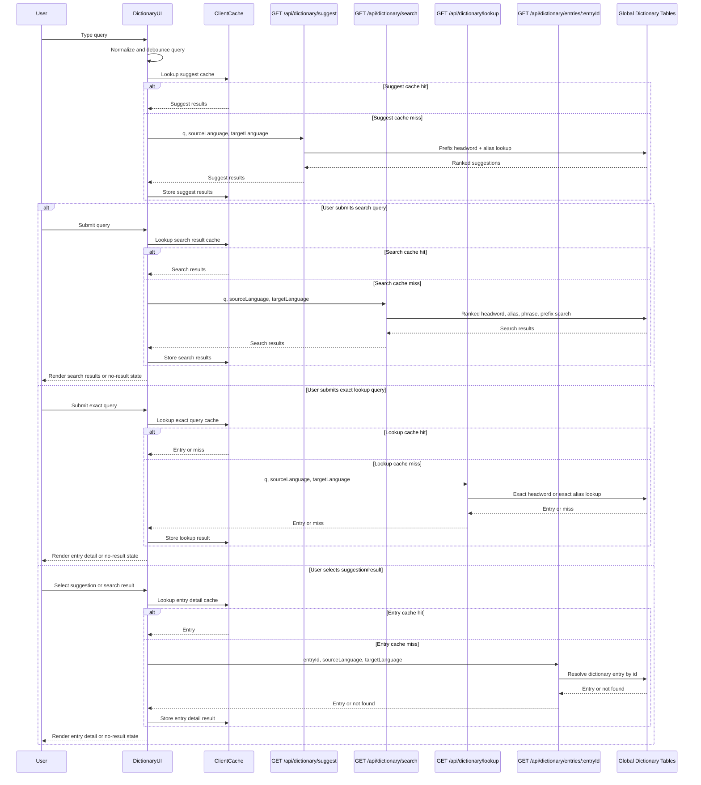

# Dictionary Flow

Dictionary search is independent from quick translation. It owns autocomplete suggestions, ranked search results, exact text lookup, entry detail rendering, miss states, and search input.

Quick translation can share the same database tables internally for exact word or short phrase lookup, but quick translation must not own dictionary search/suggest behavior. See [translation-flow.md](./translation-flow.md).

## Scope

In scope:

- Show autocomplete suggestions while typing.
- Search dictionary entries from the dictionary page or dictionary detail surfaces.
- Return ranked search results for submitted/free-text queries.
- Resolve exact typed headword or alias lookup.
- Resolve selected suggestion/search result detail by entry id.
- Render dictionary entry detail with senses and translations.
- Use the existing dictionary database tables as the global lookup source.
- Cache suggest, search, lookup, and entry-detail results in browser-tab/session memory only.

Out of scope:

- Quick translation popup state.
- `/api/translate` request behavior.
- Runtime provider, Wiktionary, Google Translate, or LLM dictionary lookup.
- Redis or server in-memory dictionary cache.
- Persisting client cache to `localStorage` or IndexedDB.
- Admin review UI.
- Pronunciation/audio.
- Target-language selection beyond Vietnamese.

## User Flow



## Endpoints

### Suggest API

#### 1. Purpose / What it is used for

Autocomplete/prefix suggestions while the learner types. This route returns compact suggestions only. It is optimized for fast dropdown results, not full dictionary detail.

#### 2. Method + path

```http
GET /api/dictionary/suggest
```

#### 3. Request input

Query params:

```ts
{
  q: string;                 // typed prefix text, 1-200 chars
  sourceLanguage: "en";
  targetLanguage: "vi";
}
```

#### 4. Success response

```ts
{
  success: true;
  data: DictionarySuggestItem[];
}
```

`DictionarySuggestItem`:

```ts
{
  id: string;                // entry id; use with GET /api/dictionary/entries/:entryId after selection
  headword: string;
  matchType: "exact" | "alias" | "prefix" | "phrase";
  matchedAlias: string | null;
  primaryTranslation: string | null;
  sourceLabel: string | null;
}
```

#### 5. Error response

```ts
{ error: string }
```

| Status | Meaning |
|--------|---------|
| `400` | Invalid query parameters |
| `401` | Missing auth |
| `500` | Unexpected suggest failure |

#### 6. Notes about cache / performance / auth

- `q` is the learner's typed prefix text.
- Empty or invalid `q` returns `400`.
- Non-empty `q` is normalized before lookup.
- Results are ranked exact headword, exact alias, then prefix matches.
- Headword matches take priority over alias duplicates.
- Response data is bounded. Default limit is `8` per query path before merge/dedupe.
- Suggest does not return full entry detail. Use `/api/dictionary/entries/:entryId` after selecting a suggestion.
- Client may cache successful suggest results in browser-tab/session memory by normalized query plus language pair.
- Runtime data comes only from the global dictionary tables.
- Route requires authenticated user.

### Search API

#### 1. Purpose / What it is used for

Submitted/free-text dictionary search. This route returns a ranked result list, not a full entry detail payload. It is used when the learner submits a query or needs search results beyond the autocomplete dropdown.

#### 2. Method + path

```http
GET /api/dictionary/search
```

#### 3. Request input

Query params:

```ts
{
  q: string;                 // typed search text, 1-200 chars
  sourceLanguage: "en";
  targetLanguage: "vi";
  limit?: number;            // default bounded server-side
}
```

#### 4. Success response

```ts
{
  success: true;
  data: DictionarySearchResult[];
}
```

`DictionarySearchResult`:

```ts
{
  id: string;                // entry id; use with GET /api/dictionary/entries/:entryId after selection
  headword: string;
  matchType: "exact" | "alias" | "phrase" | "prefix" | "contains";
  matchedText: string | null;
  primaryTranslation: string | null;
  partOfSpeech: string | null;
  sourceLabel: string | null;
}
```

#### 5. Error response

```ts
{ error: string }
```

| Status | Meaning |
|--------|---------|
| `400` | Invalid query parameters |
| `401` | Missing auth |
| `500` | Unexpected search failure |

#### 6. Notes about cache / performance / auth

- `q` is the learner's submitted search text.
- Normalized query length `<2` returns `{ success: true, data: [] }`.
- Ranking is deterministic: exact headword, exact alias, phrase match, prefix match, contains match.
- Results are deduped by entry id.
- Search returns compact result rows only. Use `/api/dictionary/entries/:entryId` after selecting a result.
- Search does not translate arbitrary sentences. It searches dictionary records.
- Client may cache successful search results in browser-tab/session memory by normalized query plus language pair.
- Response size must remain bounded by server-side limit handling.
- Runtime data comes only from the global dictionary tables.
- Route requires authenticated user.

### Lookup API

#### 1. Purpose / What it is used for

Exact typed dictionary lookup. This route returns full dictionary entry detail for a typed exact headword or alias query, or a stable miss when the typed query does not resolve.

#### 2. Method + path

```http
GET /api/dictionary/lookup
```

#### 3. Request input

Query params:

```ts
{
  q: string;                 // exact typed lookup text, 1-200 chars
  sourceLanguage: "en";
  targetLanguage: "vi";
}
```

#### 4. Success response

```ts
{
  success: true;
  data: DictionaryEntry | DictionaryMiss;
}
```

`DictionaryMiss`:

```ts
{
  headword: string;
  found: false;
}
```

#### 5. Error response

```ts
{ error: string }
```

| Status | Meaning |
|--------|---------|
| `400` | Invalid query parameters |
| `401` | Missing auth |
| `500` | Unexpected lookup failure |

#### 6. Notes about cache / performance / auth

- `q` is typed lookup text, not an entry id.
- Normalized query length `<2` returns `{ success: true, data: [] }`.
- Lookup checks exact `DictionaryEntry.normalizedHeadword`.
- If headword lookup misses, lookup checks exact `DictionaryAlias.normalizedAlias`.
- Stable misses return `DictionaryMiss`.
- Client may cache successful lookup hits and stable misses in browser-tab/session memory by normalized query plus language pair.
- Lookup does not call providers or AI at runtime.
- Use `/api/dictionary/entries/:entryId` instead of lookup after selecting a known suggestion/search result.
- Runtime data comes only from the global dictionary tables.
- Route requires authenticated user.

### Entry Detail API

#### 1. Purpose / What it is used for

Entry detail by stable dictionary entry id. This route returns full dictionary entry detail after the learner clicks a suggestion or search result.

#### 2. Method + path

```http
GET /api/dictionary/entries/:entryId
```

#### 3. Request input

Path params:

```ts
{
  entryId: string;           // DictionaryEntry.id from suggest/search result
}
```

Query params:

```ts
{
  sourceLanguage: "en";
  targetLanguage: "vi";
}
```

#### 4. Success response

```ts
{
  success: true;
  data: DictionaryEntry;
}
```

#### 5. Error response

```ts
{ error: string }
```

| Status | Meaning |
|--------|---------|
| `400` | Invalid entry id or query parameters |
| `401` | Missing auth |
| `404` | Entry id not found or not available for runtime dictionary display |
| `500` | Unexpected entry detail failure |

#### 6. Notes about cache / performance / auth

- `entryId` comes from `DictionarySuggestItem.id` or `DictionarySearchResult.id`.
- Do not normalize `entryId`; it is a database id, not learner text.
- Use this route for clicks because it avoids ambiguous text lookup.
- Client may cache successful entry detail results in browser-tab/session memory by entry id plus language pair.
- Runtime data comes only from the global dictionary tables.
- Route requires authenticated user.

## Global Lookup Tables

The existing dictionary tables are the global lookup source for dictionary functionality:

| Table | Purpose |
|-------|---------|
| `dictionary_entries` | Canonical source-language headwords |
| `dictionary_aliases` | Alternative forms, variants, aliases |
| `dictionary_senses` | Learner-facing senses, usage order, part of speech, examples |
| `dictionary_translations` | Target-language translations, primary flag, rank, status, provenance |
| `dictionary_source_audits` | Seed/import audit records |

This global lookup is database-backed. It is not Redis, not a per-process server cache, and not a client cache.

Runtime dictionary reads should return only reviewed/approved translations by default. Draft/provider/LLM-generated data can exist for offline workflows but must not appear in runtime lookup unless explicitly allowed by an admin/review flow.

## Client Caching

The dictionary UI may use browser-tab/session memory caches:

- Suggest cache by normalized query plus language pair.
- Search cache by normalized query plus language pair.
- Lookup cache by normalized query plus language pair.
- Entry detail cache by entry id plus language pair.

Do not persist dictionary cache to `localStorage`, IndexedDB, cookies, or server state in MVP.

Recommended suggest/search/lookup cache key:

```ts
{
  q: string;                 // normalized
  sourceLanguage: "en";
  targetLanguage: "vi";
}
```

Recommended entry detail cache key:

```ts
{
  entryId: string;
  sourceLanguage: "en";
  targetLanguage: "vi";
}
```

Cache successful hits and stable misses. Do not cache network/server errors.

## Server Logic

Suggest:

1. Authenticate user.
2. Validate query params.
3. Normalize query.
4. Return empty success result for normalized query length `<2`.
5. Single raw SQL query finds headword and alias prefix candidates, deduplicates by entry id (headword wins), and fetches primary translations via LATERAL join.
6. Build DTOs with primary translation and backend-generated `sourceLabel`.

Search:

1. Authenticate user.
2. Validate query params.
3. Normalize query.
4. Return empty success result for normalized query length `<2`.
5. Query exact headword and exact alias candidates.
6. Query phrase, prefix, and contains candidates.
7. Build compact result DTOs with primary translation and backend-generated `sourceLabel`.
8. Merge, dedupe by entry id, apply deterministic ranking, and return bounded results.

Lookup:

1. Authenticate user.
2. Validate query params.
3. Normalize query.
4. Single raw SQL query resolves headword (priority) or alias match and fetches senses with translations.
5. Return bounded `DictionaryEntryDto` or stable `DictionaryMissDto`.

Entry detail:

1. Authenticate user.
2. Validate path and query params.
3. Single raw SQL query resolves entry by id and source language, fetching senses with runtime-status translations.
4. Return bounded `DictionaryEntryDto` or `404`.

## Relationship To Quick Translation

Shared:

- Same dictionary database tables.
- Same normalization rules where applicable.
- Same reviewed/approved runtime status boundary.

Separate:

- Quick translation is manual highlight-to-button-to-popup.
- Dictionary search is query input, suggest dropdown, search result list, exact lookup, entry-id detail, and detail rendering.
- `/api/translate` must not expose suggest/search behavior.
- `/api/dictionary/suggest`, `/api/dictionary/search`, `/api/dictionary/lookup`, and `/api/dictionary/entries/:entryId` must not translate arbitrary sentences.

The only UI bridge allowed in MVP is navigation/opening dictionary search with selected text. Once opened, dictionary flow owns the behavior.

## Observability

Logs and Sentry metadata must avoid raw query text. Record query length, normalized length, result count, match type counts, found/miss state, target language, and status.

UI breadcrumbs cover:

- Query changed after debounce.
- Suggest cache hit/miss.
- Suggest request success/error.
- Suggest item selected.
- Search cache hit/miss.
- Search request success/error.
- Search result selected.
- Lookup cache hit/miss.
- Lookup result found/not-found/error.
- Entry detail cache hit/miss.
- Entry detail result found/not-found/error.

## Performance Budgets

The benchmark suite (`tests/performance/run-benchmarks.ts`) includes dictionary-flow coverage for suggest, search, lookup, and entry detail phases. Run it with:

```bash
pnpm test:performance
```

Dictionary results are written to `test-results/performance/dictionary-flow.json`
and rendered as a readable Markdown report at
`test-results/performance/dictionary-flow.md`. Regenerate Markdown from an
existing JSON artifact with `pnpm test:performance:report -- test-results/performance/dictionary-flow.json`.

| Scenario | Endpoint | Budget | Gate |
|----------|----------|--------|------|
| short suggest query | `GET /api/dictionary/suggest` | `0` queries | hard fail |
| headword prefix suggest | `GET /api/dictionary/suggest` | `1` query | hard fail |
| alias prefix suggest | `GET /api/dictionary/suggest` | `1` query | hard fail |
| exact headword search | `GET /api/dictionary/search` | `<=6` queries | hard fail |
| exact headword lookup | `GET /api/dictionary/lookup` | `1` query | hard fail |
| exact alias lookup | `GET /api/dictionary/lookup` | `1` query | hard fail |
| lookup miss | `GET /api/dictionary/lookup` | `1` query | hard fail |
| entry detail by id | `GET /api/dictionary/entries/:entryId` | `1` query | hard fail |

Suggest, lookup, and entry-detail use grouped raw SQL queries that combine multiple
Prisma reads into a single database round-trip. Search remains on the previous
multi-query approach; its budget will be tightened in a future optimization pass.
DB index tuning (`pg_trgm`, full-text search, materialized views) is also deferred
to a separate plan.

## V1 Boundaries

V1 focuses on functional dictionary search and deterministic lookup over the existing dictionary tables. It intentionally excludes server-side dictionary caching, persistent browser cache, admin review UI, runtime provider lookup, AI-generated dictionary answers, pronunciation/audio, and multilingual target-language selection.
