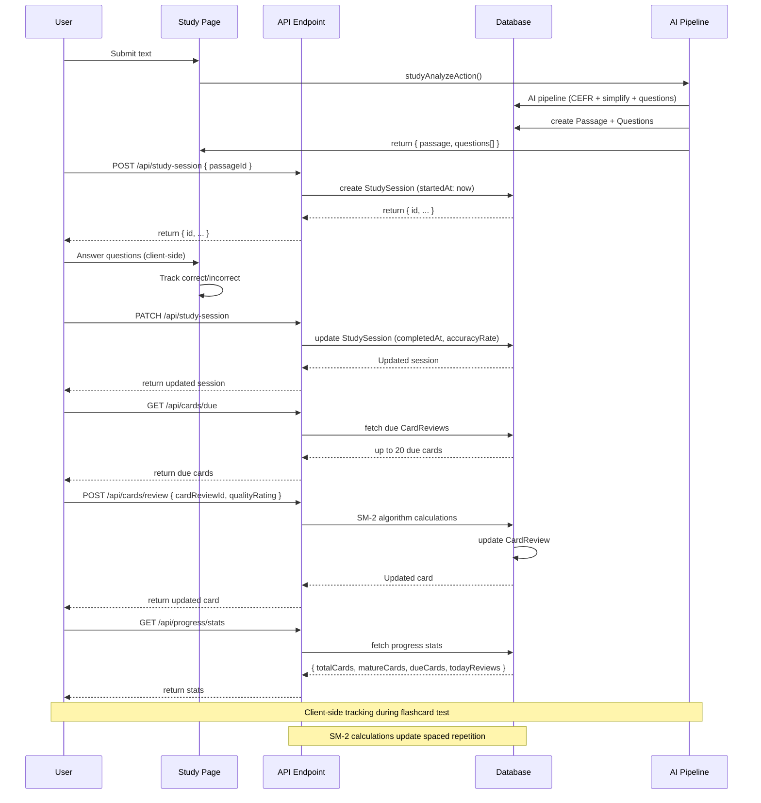

# Study Session & Card Review Flow

## Flow Diagram



---

## Endpoints

### POST `/api/study-session`
Create a new study session.

**Request:** `{ passageId: string }`

**Response:** `{ id, userId, passageId, startedAt, completedAt, cardsReviewed, correctCount, incorrectCount, accuracyRate }`

**Source:** `src/app/api/study-session/route.ts`

### PATCH `/api/study-session`
Complete a study session with results.

**Request:** `{ sessionId, cardsReviewed?, correctCount?, incorrectCount? }`

**Response:** Updated session object with `completedAt` and `accuracyRate` (auto-calculated: `correctCount / (correctCount + incorrectCount) * 100`).

**Source:** `src/app/api/study-session/route.ts`

### GET `/api/cards/due`
Fetch cards due for review (up to 20, ordered by `nextReviewDate` ascending).

**Response:** Array of `CardReview` records with nested `question` and `passage`.

**Source:** `src/app/api/cards/due/route.ts` → `getDueCards()` in `src/lib/db-utils.ts`

### POST `/api/cards/review`
Submit recall quality rating. Triggers SM-2 spaced repetition calculation.

**Request:** `{ cardReviewId: string, qualityRating: number }`

| Quality | Meaning |
|---------|---------|
| 0 | Complete blackout |
| 1 | Incorrect but recognized |
| 2 | Incorrect but answer seemed easy to recall |
| 3 | Correct with serious difficulty |
| 4 | Correct with hesitation |
| 5 | Perfect recall |

**SM-2 Calculation** (quality < 3 resets progress):

```
quality >= 3:
  repetitions += 1
  easeFactor = max(1.3, easeFactor + 0.1 - (5-quality) * (0.08 + (5-quality) * 0.02))
  intervalDays = 1 if rep==1, 6 if rep==2, round(prevInterval * easeFactor) if rep>2

quality < 3:
  repetitions = 0
  intervalDays = 1
```

**Response:** Updated `CardReview` with `easeFactor`, `intervalDays`, `repetitions`, `nextReviewDate`.

**Source:** `src/app/api/cards/review/route.ts` → `updateCardReview()` in `src/lib/db-utils.ts` → `calculateSM2Interval()` in `src/lib/db-utils.ts`

### GET `/api/progress/stats`
Aggregated progress statistics.

**Response:** `{ totalCards, matureCards, dueCards, todayReviews }`

| Metric | Definition |
|--------|------------|
| `totalCards` | Total `CardReview` records for user |
| `matureCards` | Reviews with `intervalDays >= 21` |
| `dueCards` | Reviews where `nextReviewDate <= now` |
| `todayReviews` | Reviews where `reviewedAt >= midnight today` |

**Source:** `src/app/api/progress/stats/route.ts` → `getUserProgress()` in `src/lib/db-utils.ts`

---

## File Map

```
src/
├── app/
│   └── api/
│       ├── study-session/route.ts     # POST (create) + PATCH (complete)
│       ├── cards/
│       │   ├── due/route.ts           # GET due cards
│       │   └── review/route.ts        # POST review rating
│       └── progress/
│           └── stats/route.ts         # GET progress stats
├── lib/
│   ├── db.ts                          # Prisma client
│   ├── db-utils.ts                    # getDueCards(), updateCardReview(),
│   │                                  # calculateSM2Interval(), getUserProgress(),
│   │                                  # createStudySession(), updateStudySession()
│   └── sm2-algorithm.ts               # SM-2 algorithm reference
```
