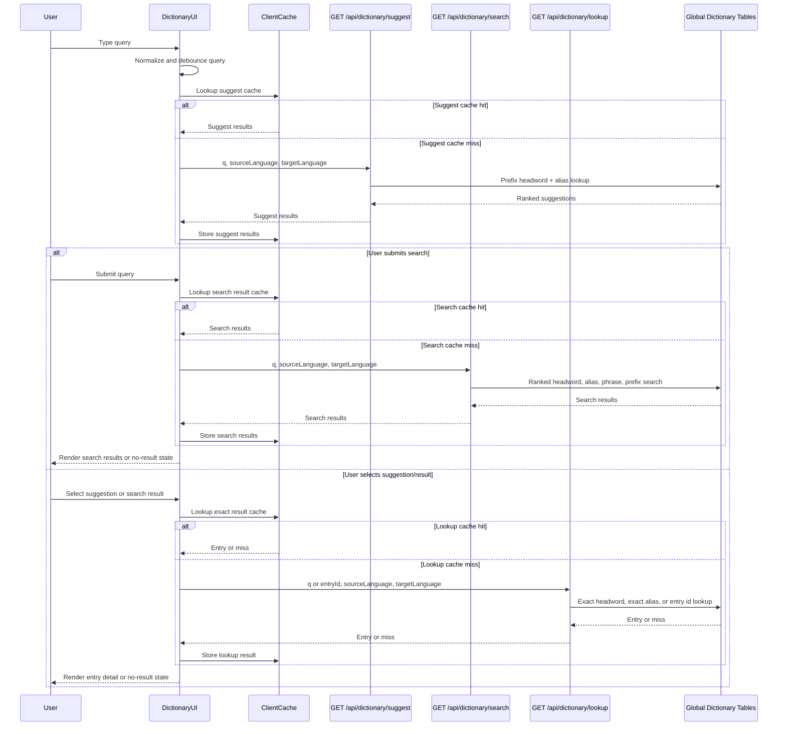

# Dictionary Flow

Dictionary search is independent from quick translation. It owns search input, autocomplete suggestions, ranked search results, exact lookup, miss states, and dictionary detail rendering.

Quick translation can share the same database tables internally for exact word or short phrase lookup, but quick translation must not own dictionary search/suggest behavior. See [translation-flow.md](./translation-flow.md).

## Scope

In scope:

- Search dictionary entries from the dictionary page or dictionary detail surfaces.
- Show autocomplete suggestions while typing.
- Return ranked search results for submitted/free-text queries.
- Resolve exact headword, alias, or entry id lookup.
- Render dictionary entry detail with senses and translations.
- Use the existing dictionary database tables as the global lookup source.
- Cache suggest, search, and lookup results in browser-tab/session memory only.

Out of scope:

- Quick translation popup state.
- `/api/translate` request behavior.
- Runtime provider, Wiktionary, Google Translate, or LLM dictionary lookup.
- Redis or server in-memory dictionary cache.
- Persisting client cache to `localStorage` or IndexedDB.
- Admin review UI.
- Pronunciation/audio.
- Target-language selection beyond Vietnamese.

## User Flow



## Endpoints

### Suggest API

#### 1. Purpose / What it is used for

Autocomplete/prefix suggestions while the learner types. This route returns compact suggestions only. It is optimized for fast dropdown results, not full dictionary detail.

#### 2. Method + path

```http
GET /api/dictionary/suggest
```

#### 3. Request input

Query params:

```ts
{
  q: string;                 // 1-200 chars
  sourceLanguage: "en";
  targetLanguage: "vi";
}
```

#### 4. Success response

```ts
{
  success: true;
  data: DictionarySuggestItem[];
}
```

`DictionarySuggestItem`:

```ts
{
  id: string;
  headword: string;
  matchType: "exact" | "alias" | "prefix" | "phrase";
  matchedAlias: string | null;
  primaryTranslation: string | null;
  sourceLabel: string | null;
}
```

#### 5. Error response

```ts
{ error: string }
```

| Status | Meaning |
|--------|---------|
| `400` | Invalid query parameters |
| `401` | Missing auth |
| `500` | Unexpected suggest failure |

#### 6. Notes about cache / performance / auth

- Normalized query length `<2` returns `{ success: true, data: [] }`.
- Results are ranked exact headword, exact alias, then prefix matches.
- Headword matches take priority over alias duplicates.
- Response data is bounded. Default limit is `8` per query path before merge/dedupe.
- Suggest does not return full entry detail. Use `/api/dictionary/lookup` for detail.
- Client may cache successful suggest results in browser-tab/session memory by normalized query plus language pair.
- Runtime data comes only from the global dictionary tables.
- Route requires authenticated user.

### Search API

#### 1. Purpose / What it is used for

Submitted/free-text dictionary search. This route returns a ranked result list, not a full entry detail payload. It is used when the learner submits a query or needs search results beyond the autocomplete dropdown.

#### 2. Method + path

```http
GET /api/dictionary/search
```

#### 3. Request input

Query params:

```ts
{
  q: string;                 // 1-200 chars
  sourceLanguage: "en";
  targetLanguage: "vi";
  limit?: number;            // default bounded server-side
}
```

#### 4. Success response

```ts
{
  success: true;
  data: DictionarySearchResult[];
}
```

`DictionarySearchResult`:

```ts
{
  id: string;
  headword: string;
  matchType: "exact" | "alias" | "phrase" | "prefix" | "contains";
  matchedText: string | null;
  primaryTranslation: string | null;
  partOfSpeech: string | null;
  sourceLabel: string | null;
}
```

#### 5. Error response

```ts
{ error: string }
```

| Status | Meaning |
|--------|---------|
| `400` | Invalid query parameters |
| `401` | Missing auth |
| `500` | Unexpected search failure |

#### 6. Notes about cache / performance / auth

- Normalized query length `<2` returns `{ success: true, data: [] }`.
- Ranking is deterministic: exact headword, exact alias, phrase match, prefix match, contains match.
- Results are deduped by entry id.
- Search returns compact result rows only. Use `/api/dictionary/lookup` for full multi-sense detail.
- Search does not translate arbitrary sentences. It searches dictionary records.
- Client may cache successful search results in browser-tab/session memory by normalized query plus language pair.
- Response size must remain bounded by server-side limit handling.
- Runtime data comes only from the global dictionary tables.
- Route requires authenticated user.

### Lookup API

#### 1. Purpose / What it is used for

Exact dictionary lookup and entry detail. This route returns the full dictionary entry detail payload after a learner selects a suggestion/search result or submits an exact lookup query.

#### 2. Method + path

```http
GET /api/dictionary/lookup
```

#### 3. Request input

Query params:

```ts
{
  q?: string;                // 1-200 chars
  entryId?: string;          // preferred after selecting search/suggest result
  sourceLanguage: "en";
  targetLanguage: "vi";
}
```

At least one of `q` or `entryId` is required.

#### 4. Success response

```ts
{
  success: true;
  data: DictionaryEntry | DictionaryMiss;
}
```

`DictionaryMiss`:

```ts
{
  headword: string;
  found: false;
}
```

#### 5. Error response

```ts
{ error: string }
```

| Status | Meaning |
|--------|---------|
| `400` | Invalid query parameters, or neither `q` nor `entryId` provided |
| `401` | Missing auth |
| `500` | Unexpected lookup failure |

#### 6. Notes about cache / performance / auth

- If `entryId` is provided, resolve that entry directly.
- If `q` is provided, normalize query.
- Lookup then checks exact `DictionaryEntry.normalizedHeadword`.
- If headword lookup misses, lookup checks exact `DictionaryAlias.normalizedAlias`.
- Stable misses return `DictionaryMiss`.
- Client may cache successful lookup hits and stable misses in browser-tab/session memory by normalized query or entry id plus language pair.
- Lookup does not call providers or AI at runtime.
- Runtime data comes only from the global dictionary tables.
- Route requires authenticated user.

## Global Lookup Tables

The existing dictionary tables are the global lookup source for dictionary functionality:

| Table | Purpose |
|-------|---------|
| `dictionary_entries` | Canonical source-language headwords |
| `dictionary_aliases` | Alternative forms, variants, aliases |
| `dictionary_senses` | Learner-facing senses, usage order, part of speech, examples |
| `dictionary_translations` | Target-language translations, primary flag, rank, status, provenance |
| `dictionary_source_audits` | Seed/import audit records |

This global lookup is database-backed. It is not Redis, not a per-process server cache, and not a client cache.

Runtime dictionary reads should return only reviewed/approved translations by default. Draft/provider/LLM-generated data can exist for offline workflows but must not appear in runtime lookup unless explicitly allowed by an admin/review flow.

## Client Caching

The dictionary UI may use browser-tab/session memory caches:

- Suggest cache by normalized query plus language pair.
- Search cache by normalized query plus language pair.
- Lookup cache by normalized query or entry id plus language pair.

Do not persist dictionary cache to `localStorage`, IndexedDB, cookies, or server state in MVP.

Recommended suggest/search cache key:

```ts
{
  q: string;                 // normalized
  sourceLanguage: "en";
  targetLanguage: "vi";
}
```

Recommended lookup cache key:

```ts
{
  q?: string;                // normalized
  entryId?: string;
  sourceLanguage: "en";
  targetLanguage: "vi";
}
```

Cache successful hits and stable misses. Do not cache network/server errors.

## Server Logic

Suggest:

1. Authenticate user.
2. Validate query params.
3. Normalize query.
4. Return empty success result for normalized query length `<2`.
5. Query headword prefix matches.
6. Query alias prefix matches.
7. Build DTOs with primary translation and backend-generated `sourceLabel`.
8. Merge, dedupe by entry id, rank, and return.

Search:

1. Authenticate user.
2. Validate query params.
3. Normalize query.
4. Return empty success result for normalized query length `<2`.
5. Query exact headword and exact alias candidates.
6. Query phrase, prefix, and contains candidates.
7. Build compact result DTOs with primary translation and backend-generated `sourceLabel`.
8. Merge, dedupe by entry id, apply deterministic ranking, and return bounded results.

Lookup:

1. Authenticate user.
2. Validate query params.
3. Resolve by `entryId` when provided.
4. Otherwise normalize `q`.
5. Resolve exact headword.
6. If missing, resolve exact alias.
7. Return bounded `DictionaryEntryDto` or stable `DictionaryMissDto`.

## Relationship To Quick Translation

Shared:

- Same dictionary database tables.
- Same normalization rules where applicable.
- Same reviewed/approved runtime status boundary.

Separate:

- Quick translation is manual highlight-to-button-to-popup.
- Dictionary search is query input, suggest dropdown, search result list, exact lookup, and detail rendering.
- `/api/translate` must not expose suggest/search behavior.
- `/api/dictionary/suggest`, `/api/dictionary/search`, and `/api/dictionary/lookup` must not translate arbitrary sentences.

The only UI bridge allowed in MVP is navigation/opening dictionary search with selected text. Once opened, dictionary flow owns the behavior.

## Observability

Logs and Sentry metadata must avoid raw query text. Record query length, normalized length, result count, match type counts, found/miss state, target language, and status.

UI breadcrumbs cover:

- Query changed after debounce.
- Suggest cache hit/miss.
- Suggest request success/error.
- Suggest item selected.
- Search cache hit/miss.
- Search request success/error.
- Search result selected.
- Lookup cache hit/miss.
- Lookup result found/not-found/error.

## Performance Budgets

The benchmark suite (`tests/performance/run-benchmarks.ts`) includes dictionary-flow coverage for suggest, search, and lookup phases. Run it with:

```bash
pnpm test:performance
```

Dictionary results are written to `test-results/performance/dictionary-flow.json`.

| Scenario | Endpoint | Budget | Gate |
|----------|----------|--------|------|
| short suggest query | `GET /api/dictionary/suggest` | `0` queries | hard fail |
| headword prefix suggest | `GET /api/dictionary/suggest` | `<=12` queries | hard fail |
| alias prefix suggest | `GET /api/dictionary/suggest` | `<=12` queries | hard fail |
| exact headword search | `GET /api/dictionary/search` | `<=6` queries | hard fail |
| exact headword lookup | `GET /api/dictionary/lookup` | `<=6` queries | hard fail |
| exact alias lookup | `GET /api/dictionary/lookup` | `<=8` queries | hard fail |
| lookup miss | `GET /api/dictionary/lookup` | `<=6` queries | hard fail |

## V1 Boundaries

V1 focuses on functional dictionary search and deterministic lookup over the existing dictionary tables. It intentionally excludes server-side dictionary caching, persistent browser cache, admin review UI, runtime provider lookup, AI-generated dictionary answers, pronunciation/audio, and multilingual target-language selection.
