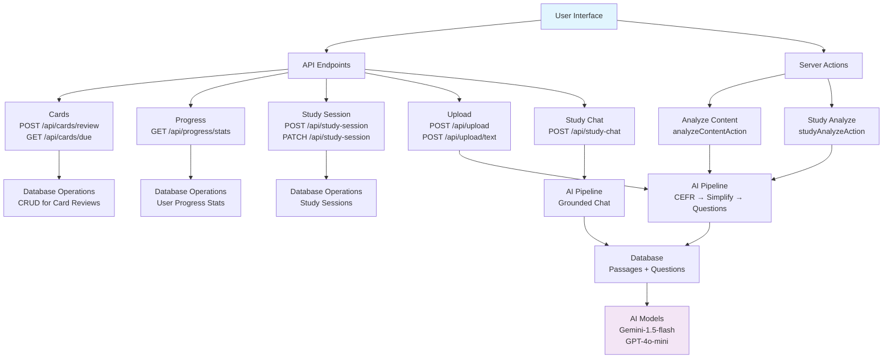

# API Overview



All endpoints return `{ success: true, data: ... }` on success or `{ error: "..." }` on failure.

**Auth:** Demo-only. All endpoints use hardcoded `demo@example.com` user. No auth headers required.

---

## Simple CRUD Endpoints

### Cards

#### POST `/api/cards/review`
Submit a card review quality rating (SM-2 spaced repetition).

| Field | Type | Required | Description |
|-------|------|----------|-------------|
| `cardReviewId` | string | yes | Card review record ID |
| `qualityRating` | number | yes | 0-5 rating (0=complete blackout, 5=perfect) |

**Response:** Updated card review with `easeFactor`, `intervalDays`, `repetitions`, `nextReviewDate`.

**Source:** `src/app/api/cards/review/route.ts` → `updateCardReview()` in `src/lib/db-utils.ts`

---

#### GET `/api/cards/due`
Fetch up to 20 cards due for review, ordered by next review date.

**Response:** Array of card review records with nested `question` and `passage`.

**Source:** `src/app/api/cards/due/route.ts` → `getDueCards()` in `src/lib/db-utils.ts`

---

### Progress

#### GET `/api/progress/stats`
Fetch user progress statistics.

**Response:**

```ts
{
  totalCards: number;    // total card reviews created
  matureCards: number;   // reviews with intervalDays >= 21
  dueCards: number;      // reviews where nextReviewDate <= now
  todayReviews: number;  // reviews done since midnight today
}
```

**Source:** `src/app/api/progress/stats/route.ts` → `getUserProgress()` in `src/lib/db-utils.ts`

---

### Study Session

#### POST `/api/study-session`
Create a new study session.

| Field | Type | Required | Description |
|-------|------|----------|-------------|
| `passageId` | string | yes | Passage to study |

**Response:** Created session with `id`, `userId`, `passageId`, `startedAt`.

#### PATCH `/api/study-session`
Complete a study session with results.

| Field | Type | Required | Description |
|-------|------|----------|-------------|
| `sessionId` | string | yes | Session ID |
| `cardsReviewed` | number | no | Total cards reviewed |
| `correctCount` | number | no | Correct answers |
| `incorrectCount` | number | no | Incorrect answers |

**Response:** Updated session with `completedAt`, `accuracyRate` (calculated from correct/incorrect).

**Source:** `src/app/api/study-session/route.ts`

---

## Complex Flow Endpoints

These have dedicated flow documentation:

| Endpoint | Flow Doc |
|----------|----------|
| POST `/api/upload` (file) | [upload-flow.md](./upload-flow.md) |
| POST `/api/upload/text` (raw text) | [upload-flow.md](./upload-flow.md) |
| `analyzeContentAction()` (server action) | [upload-flow.md](./upload-flow.md) |
| `studyAnalyzeAction()` (server action) | [upload-flow.md](./upload-flow.md) |
| Study session + card review lifecycle | [study-session-flow.md](./study-session-flow.md) |
| POST `/api/study-chat` (streaming) | [study-chat-flow.md](./study-chat-flow.md) |

---

## Server Actions

Server actions are React server-side functions, not HTTP endpoints. Called via `useActionState` or `useServerAction` in components.

| Action | Location | Purpose |
|--------|----------|---------|
| `analyzeContentAction(formData)` | `src/app/actions/analyze.ts` | Process uploaded text → CEFR detection → simplification → question generation → DB storage |
| `studyAnalyzeAction({ text, title })` | `src/app/actions/analyze.ts` | Same as above but returns full passage + questions data (for study page) |

---

## Support Libraries

| File | Purpose |
|------|---------|
| `src/lib/db-utils.ts` | DB operations: CRUD for users, passages, questions, card reviews, study sessions, SM-2 algorithm |
| `src/lib/upload-validator.ts` | File/text validation (size, type, length) |
| `src/lib/pdf-parser.ts` | PDF text extraction |
| `src/lib/ai/cefr-detector.ts` | AI CEFR level detection + heuristic fallback |
| `src/lib/ai/content-simplifier.ts` | AI content simplification to target CEFR level |
| `src/lib/ai/question-generator.ts` | AI comprehension question generation |
| `src/lib/ai/prompt-utils.ts` | Prompt injection defense (`wrapUserText`) |
| `src/lib/cefr-utils.ts` | CEFR level helpers (colors, labels) |
| `src/lib/sm2-algorithm.ts` | SM-2 spaced repetition algorithm |
