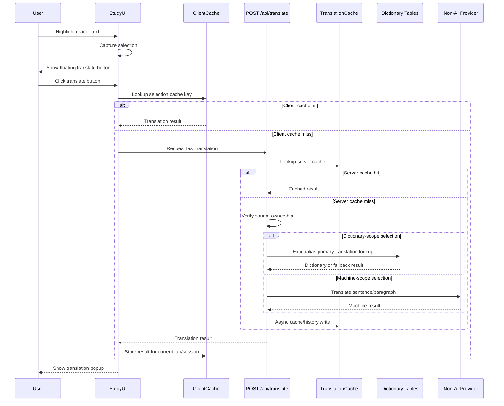

# Translation Flow

Inline translation on `/study` is a fast, manual English-to-Vietnamese action. The learner highlights visible reader text, clicks the floating translate button, sees a quick translation popup, and can save the result to vocabulary.

Dictionary search and suggestion behavior is intentionally separate. See [dictionary-flow.md](./dictionary-flow.md).

This document describes the target fast-only contract for the next implementation pass. Legacy detailed translation mode may still exist in code until the implementation plan is completed.

## Scope

In scope:

- Highlight word, phrase, sentence, or paragraph text in the study reader.
- Show a floating translate button after valid selection.
- Translate only after the learner clicks the button.
- Use a client memory cache for repeated selections in the current browser tab/session.
- Call `POST /api/translate` only on client cache miss.
- Save successful translations to vocabulary.

Out of scope:

- Dictionary search and autocomplete UX.
- Detailed AI translation.
- Translation history viewer.
- Persisting client cache to `localStorage` or IndexedDB.
- Target-language selection beyond Vietnamese.
- Custom right-click menu.
- Pronunciation audio.

## User Flow



## Endpoints

### POST `/api/translate`

Request:

```ts
{
  text: string;              // 1-500 chars
  context: string;           // 1-4000 chars, usually surrounding sentence/paragraph
  sourceId: string;          // owned Passage id
  sourceLanguage: "en";
  targetLanguage: "vi";
}
```

Success response:

```ts
{ success: true, data: TranslationResult }
```

Translation result:

```ts
{
  translation: string;
  type: string | null;
  provider: "cache" | "dictionary" | "fallback" | "google_translate";
}
```

Failure responses use `{ error: string }` with:

| Status | Meaning |
|--------|---------|
| `400` | Invalid JSON/body |
| `401` | Missing auth |
| `404` | Inaccessible source |
| `500` | Unexpected failure or non-AI provider failure |

### POST `/api/vocabulary`

Request:

```ts
{
  sourceId: string;
  selectedText: string;      // 1-500 chars
  translation: string;       // 1-500 chars
  contextSentence: string;   // 1-4000 chars
  sourceLanguage: "en";
  targetLanguage: "vi";
  type?: string;
}
```

The route upserts a `VocabularyItem` using a hash of `userId`, `sourceId`, selected text, context sentence, and target language. Re-saving the same selection reuses the same row.

## Client Logic

Study reader selection capture and translation execution are separated:

1. Highlighting text captures the selection and renders a floating translate button.
2. Clicking the translate button checks the client memory cache.
3. On client cache hit, the UI renders the cached translation without calling the API.
4. On client cache miss, the UI calls `POST /api/translate`.
5. Successful API responses are stored in the client memory cache for the current tab/session.
6. The popup can expose Save vocabulary after a successful translation.

Double-click selection is deduplicated. Same selection within 300ms is ignored.

## Client Memory Cache

The client cache is a browser-tab/session memory `Map`. It is cleared on full refresh, tab close, or app reload.

Do not persist this cache to `localStorage`, IndexedDB, cookies, or server state in MVP.

Recommended key fields:

```ts
{
  sourceId: string;
  selectedText: string;      // normalized whitespace/case policy must be explicit
  contextSentence: string;   // clamped same as request context
  sourceLanguage: "en";
  targetLanguage: "vi";
}
```

Recommended value:

```ts
TranslationResult
```

The cache stores successful translations only. Failed responses should not be cached in MVP.

## Server Logic

Translation must not call AI. It resolves in this order:

1. Authenticate user.
2. Build server translation cache key.
3. Check `TranslationCache`.
4. If cache hit, return `provider: "cache"` without redundant source fetch. Cache hit is keyed by `userId + sourceId`, so it proves ownership for this result.
5. If cache miss, verify the source passage is owned by the user.
6. Classify selection scope:
   - **Dictionary scope:** single word or short phrase, `<=4` tokens, no sentence-ending punctuation.
   - **Machine scope:** sentence, paragraph, or longer phrase.
7. Dictionary scope uses the global dictionary tables for exact/alias primary translation lookup.
8. Machine scope uses the non-AI machine translation provider.
9. Return the resolved translation as soon as available.
10. Persist server cache and history asynchronously with error logging.

If async cache persistence fails, the current request still succeeds. The only user-visible cost is that a later identical request may miss server cache and recompute the translation.

## Internal Dictionary Use

Quick translation may use the dictionary tables internally for word and short phrase selections, but it must not become a dictionary search flow.

Allowed:

- Exact headword lookup.
- Exact alias lookup.
- Primary translation selection.
- Deterministic fallback for dictionary misses.

Not allowed in this flow:

- Prefix suggest search.
- Search results lists.
- Multi-sense dictionary detail rendering.
- Autocomplete behavior.

Those belong to [dictionary-flow.md](./dictionary-flow.md).

## Non-AI Translation Provider

Fast sentence/paragraph translation uses a Google Translate-compatible public endpoint. No API key is required. If the provider fails, the route returns the standard `500` error without falling back to AI.

## Observability

Routes use `createRequestLogger()` and `createRequestLogContext()`.

Spans should cover:

- Auth.
- Client cache miss API request.
- Server cache lookup.
- Source lookup on server cache miss.
- Dictionary lookup for dictionary-scope selections.
- Non-AI provider call for machine-scope selections.
- Async cache/history writes.

Logs and Sentry metadata must avoid raw selected text and raw context. Record lengths, source id, target language, provider, cache hit state, and result status instead.

UI breadcrumbs cover:

- Selection capture.
- Translate button click.
- Client cache hit/miss.
- Fast translation request/result.
- Vocabulary save.

## Performance Budgets

The benchmark script (`tests/performance/translate-flow-benchmark.ts`) enforces query count budgets:

| Scenario | Budget | Gate |
|----------|--------|------|
| single-word dictionary hit | `<=4` queries | hard fail |
| phrase dictionary hit | `<=4` queries | soft warn |
| fallback miss | `<=5` queries | soft warn |
| server cache repeat | `<=2` queries | soft warn |

A warm-up request runs before measured scenarios. Results are written to `test-results/performance/translate-flow.json` with `budget`, `actual`, and `passed` fields per scenario.

Client memory cache hits should not call `POST /api/translate`; they are a UI-level optimization and are not counted by the server benchmark.

## V1 Boundaries

V1 intentionally excludes detailed AI translation, dictionary autocomplete, dictionary detail rendering inside quick translate, a custom right-click menu, a translation history viewer, flashcard generation from vocabulary, pronunciation audio, and target-language selection beyond Vietnamese.
