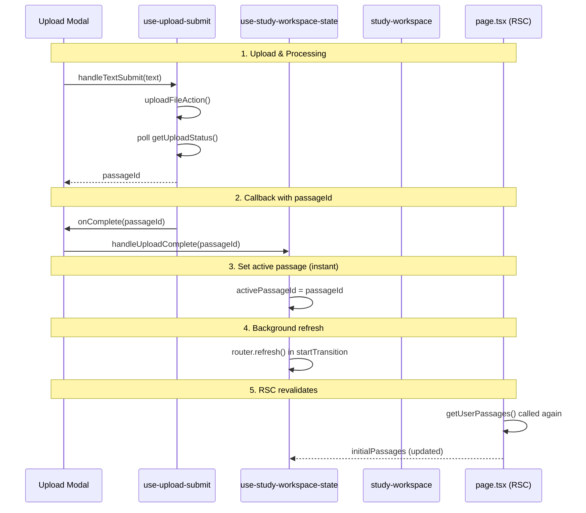

# Passage Render After Upload

## Overview

How a newly uploaded passage appears in the UI after processing completes.

---

## Current Flow (Optimized)



---

## Key Components

### 1. `use-upload-submit.ts` - Client Polling

**Location:** `src/features/upload/hooks/use-upload-submit.ts`

**Responsibility:**
- Call `uploadFileAction()` to create job
- Poll `getUploadStatus()` every 2s
- Call `onComplete(passageId)` callback on completion (no navigation)

```typescript
const { passageId } = await pollJobStatus(result.data.jobId);
onComplete?.(passageId);
return passageId;
```

**Flow:**
1. User submits text/file
2. Create upload job → return jobId
3. Poll status until DONE/FAILED
4. Navigate to study page with passageId

---

### 2. `page.tsx` - Server Component (RSC)

**Location:** `src/app/[locale]/(dashboard)/study/page.tsx`

**Responsibility:**
- Fetch all user's passages from DB
- Pass to client component as `initialPassages`

```typescript
export default async function StudyPage() {
  const rows = await getUserPassages(userId);
  const initialPassages: PassageData[] = rows.map(...);
  return <StudyPageClient initialPassages={initialPassages} />;
}
```

**Key behavior:**
- Runs on server
- Fetches passages from PostgreSQL
- Returns full PassageData (content, cefrLevel, etc.)
- `dynamic = "force-dynamic"` - always fetches fresh data

---

### 3. `use-study-workspace-state.ts` - State Management

**Location:** `src/app/[locale]/(dashboard)/study/_hooks/use-study-workspace-state.ts`

**Responsibility:**
- Manage passages state
- Handle optimistic updates
- Trigger revalidation

**Key state:**
```typescript
interface StudyState {
  passages: PassageData[];
  activePassageId: string | null;
  status: StudyStatus;
  // ...
}
```

**Passages management:**
```typescript
// Optimistic state for instant feedback
const [passages, applyPassagesAction] = useOptimistic(
  initialPassages,
  passagesReducer,
);

// Get active passage
const activePassage = useMemo(
  () => passages.find(p => p.id === state.activePassageId) ?? null,
  [passages, state.activePassageId],
);
```

**Upload completion handler:**
```typescript
const handleUploadComplete = useCallback((passageId: string) => {
  // 1. Set active passage (instant - no optimistic add needed)
  setState(prev => ({
    ...prev,
    activePassageId: passageId,
    uploadModalOpen: false,
    status: "ready",
  }));

  // 2. Trigger server revalidation in background
  startTransition(() => {
    router.refresh();
  });
}, [router]);
```

---

### 4. `study-workspace.tsx` - UI Rendering

**Location:** `src/app/[locale]/(dashboard)/study/_components/study-workspace.tsx`

**Responsibility:**
- Render passage content
- Handle selection, artifacts, etc.

**Passage rendering:**
```typescript
const activePassage = useMemo(
  () => passages.find(p => p.id === state.activePassageId) ?? null,
  [passages, state.activePassageId],
);

// ...

{activePassage && (
  <StudyContentPanel
    passage={activePassage}
    // ...
  />
)}
```

---

## Data Flow Diagram

```
┌─────────────────────────────────────────────────────────────┐
│  Upload Flow                                                │
├─────────────────────────────────────────────────────────────┤
│                                                              │
│  User clicks "Submit"                                       │
│         │                                                    │
│         ▼                                                    │
│  ┌─────────────────┐                                        │
│  │ use-upload-submit│                                        │
│  │  - uploadFileAction()                                      │
│  │  - poll getUploadStatus()                                 │
│  └────────┬────────┘                                        │
│           │                                                  │
│           │ passageId                                        │
│           ▼                                                  │
│  router.push(/study?passageId=xxx)                          │
│           │                                                  │
└───────────┼─────────────────────────────────────────────────┘
            │
            ▼
┌─────────────────────────────────────────────────────────────┐
│  Study Page Load                                            │
├─────────────────────────────────────────────────────────────┤
│                                                              │
│  page.tsx (Server Component)                                │
│         │                                                    │
│         ▼                                                    │
│  getUserPassages(userId) → DB query                         │
│         │                                                    │
│         ▼                                                    │
│  <StudyPageClient initialPassages={...} />                  │
│           │                                                  │
└───────────┼─────────────────────────────────────────────────┘
            │
            ▼
┌─────────────────────────────────────────────────────────────┐
│  Client Hydration                                            │
├─────────────────────────────────────────────────────────────┤
│                                                              │
│  use-study-workspace-state                                  │
│         │                                                    │
│         ├── useOptimistic(initialPassages)                  │
│         │                                                   │
│         ├── setState({ activePassageId: passageId })        │
│         │                                                   │
│         └── handleUploadComplete() called?                   │
│                      │                                       │
│                      ├── applyPassagesAction({add})        │
│                      └── router.refresh()                   │
│                              │                              │
└──────────────────────────────┼──────────────────────────────┘
                               │
                               ▼
┌─────────────────────────────────────────────────────────────┐
│  RSC Revalidation                                           │
├─────────────────────────────────────────────────────────────┤
│                                                              │
│  router.refresh() triggers:                                  │
│         │                                                    │
│         ▼                                                    │
│  page.tsx re-runs on server                                 │
│         │                                                    │
│         ▼                                                    │
│  getUserPassages() returns updated list                     │
│         │                                                    │
│         ▼                                                    │
│  Passages rehydrated with server data                        │
│                                                              │
└─────────────────────────────────────────────────────────────┘
```

---

## Passage Selection Logic

**Initial load:**
```typescript
function getMostRecentPassageId(passages: PassageData[]): string | null {
  // Sort by createdAt descending
  // Return most recent if no passageId specified
  return passages.reduce<PassageData | null>((latest, passage) => {
    if (!latest) return passage;
    return passage.createdAt > latest.createdAt ? passage : latest;
  }, null)?.id ?? null;
}

// In useStudyWorkspaceState:
const initialId = getMostRecentPassageId(initialPassages);
```

**Logic:**
1. On initial load → use most recent passage (by `createdAt`)
2. After upload → `handleUploadComplete(passageId)` sets active directly
3. If no passages → `activePassageId = null`, status = "idle"

---

## Optimistic Updates

The system uses React `useOptimistic` for instant feedback:

```typescript
const [passages, applyPassagesAction] = useOptimistic(
  initialPassages,
  passagesReducer,
);
```

**Why useOptimistic?**
- Upload completes → passage appears instantly (before revalidation)
- No loading spinner between upload and view
- Feels fast to user

**Revalidation flow:**
1. Optimistic update: passage added immediately
2. `router.refresh()`: triggers server revalidation
3. Server re-renders: returns fresh data from DB
4. React reconciles: replaces optimistic with server data

---

## File Structure

```
src/app/[locale]/(dashboard)/study/
├── page.tsx                          # RSC: fetches passages
├── _components/
│   └── study-workspace.tsx           # Main UI container
├── _hooks/
│   └── use-study-workspace-state.ts  # State management
└── _actions/
    └── actions.ts                   # Server actions

src/features/upload/
├── hooks/
│   └── use-upload-submit.ts         # Upload + polling
└── ui/
    └── upload-modal.tsx             # Upload UI

src/features/passage/
├── db/
│   └── passage-queries.ts           # DB queries
└── schemas/
    └── passage.schema.ts            # Types
```

---

## State Transitions

| Event | State Changes |
|-------|--------------|
| Page load | `passages` = DB data, `activePassageId` = most recent |
| Upload start | `status = "uploading"`, `isUploading = true` |
| Upload complete | `passages += new`, `activePassageId = new.id`, `router.refresh()` |
| Select passage | `activePassageId = selected.id`, `status = "ready"` |
| Delete passage | `passages -= deleted`, select next most recent |

---

## Related Files

| File | Purpose |
|------|---------|
| `page.tsx` | Server data fetching |
| `study-workspace.tsx` | Main UI component |
| `use-study-workspace-state.ts` | Client state management |
| `use-upload-submit.ts` | Upload + polling |
| `passage-queries.ts` | Database queries |
| `passage.schema.ts` | TypeScript types |

---

## TODO / Future Improvements

- [ ] WebSocket for real-time updates instead of polling
- [ ] SSE for live progress updates during upload
- [ ] Optimistic passage selection from URL params
