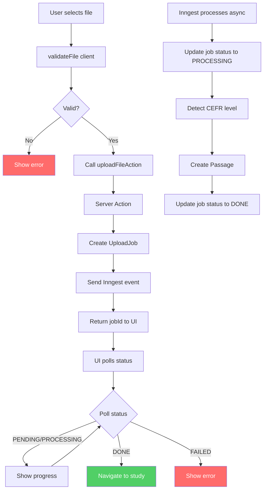
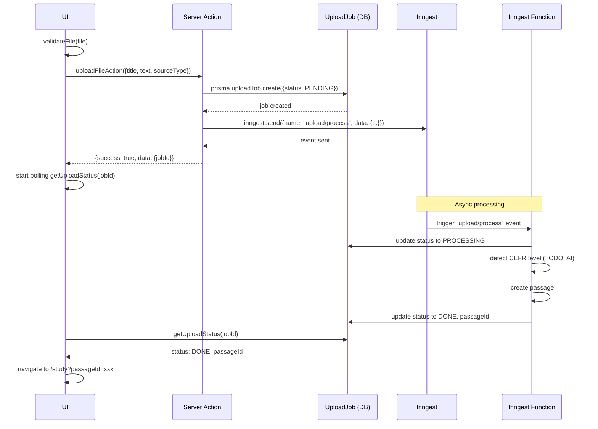
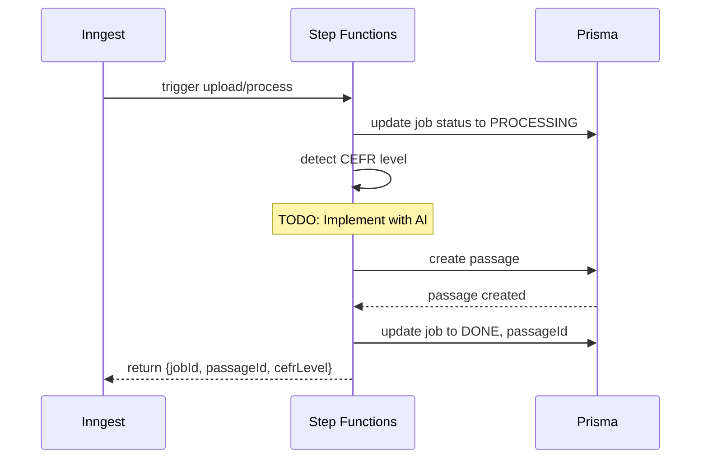
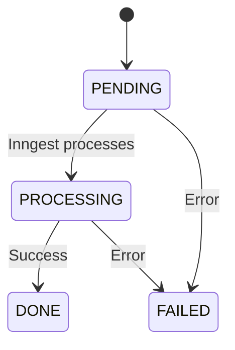

# Upload Feature Data Flow

## Overview

Start: User selects a file on the UI component.
End: UI displays the result (success -> new passage, or error -> error state).
The data flow now uses event-driven architecture with Inngest for background processing.

---

## 1. Overall Data Flow (Event-Driven)



---

## 2. Upload Sequence



---

## 3. Inngest Function Processing



---

## 4. Job Status Polling



---

## File Structure

```
src/features/upload/
├── actions.ts                     # Server Action entry point
├── services/
│   ├── upload-service.ts       # Legacy - not used in new flow
│   └── content-analysis.service.ts
├── hooks/
│   └── use-upload-submit.ts   # Polling hook
├── ui/
│   └── upload-modal.tsx
├── lib/
│   ├── upload-validation.ts
│   └── parsers/pdf.ts
└── schemas/
    └── upload.schema.ts

src/services/inngest/
├── client.ts                   # Inngest client + event types
└── functions/
    └── process-upload.ts       # Inngest function handler

src/app/api/inngest/
└── route.ts                   # Inngest webhook endpoint
```

## Layer Responsibilities

| Layer | File | Responsibility |
|-------|------|----------------|
| UI | `upload-modal.tsx` | User interaction, error display |
| UI | `use-upload-submit.ts` | Polling job status |
| Action | `actions.ts` | Create job, send event |
| Queue | `inngest/client.ts` | Event definitions |
| Worker | `process-upload.ts` | Background processing |
| Database | `prisma/uploadJob` | Job status tracking |

## API Contracts

### uploadFileAction Input
```typescript
{
  title: string,
  text: string,
  sourceType: "paste" | "txt" | "pdf" | "youtube",
  blobPath?: string
}
```

### uploadFileAction Response
```typescript
// Success
{ success: true, data: { jobId: string } }
```

### getUploadStatus Response
```typescript
// Success
{ 
  success: true, 
  data: { 
    status: "PENDING" | "PROCESSING" | "DONE" | "FAILED",
    passageId?: string,
    error?: string
  } 
}
```

## Error Handling

| Stage | Error | UI Response |
|-------|-------|-------------|
| Upload | Invalid file | Show validation error |
| Create Job | DB error | Show error toast |
| Send Event | Inngest error | Show error toast |
| Poll Status | Job not found | Show error |
| Inngest Processing | Exception | Update job to FAILED |

## Data Flow Closure at UI

```
User Action -> [Async Processing] -> UI Response -> User Sees Result
     ^                                              |
     -------------------------------------------------
                    (Closure via polling)
```
