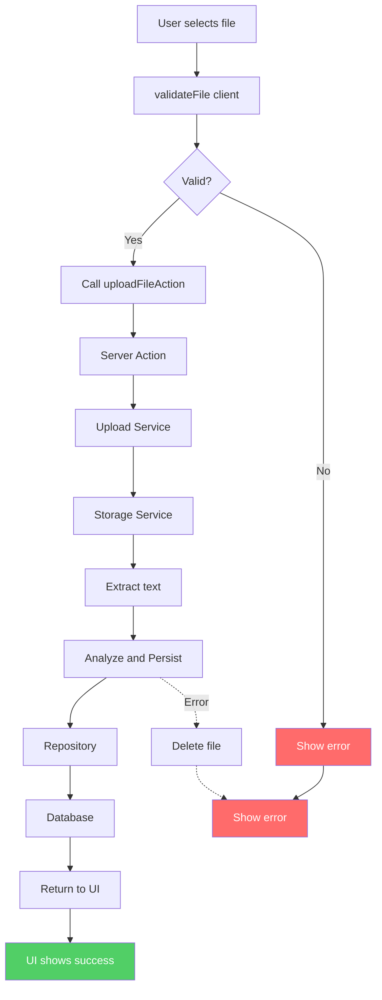
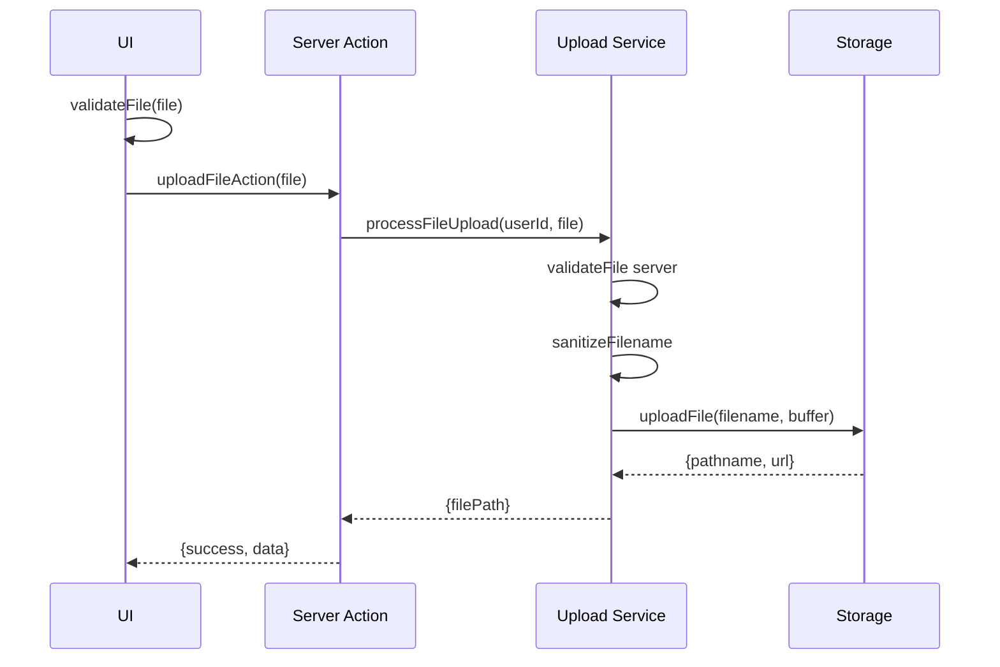
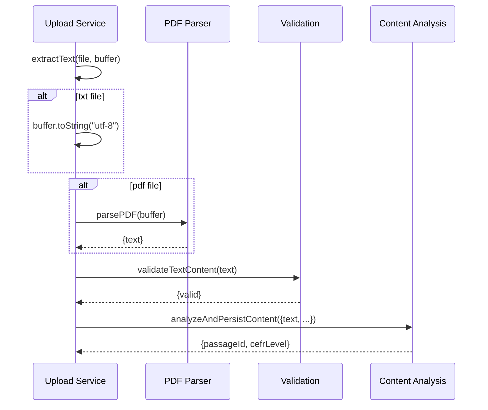
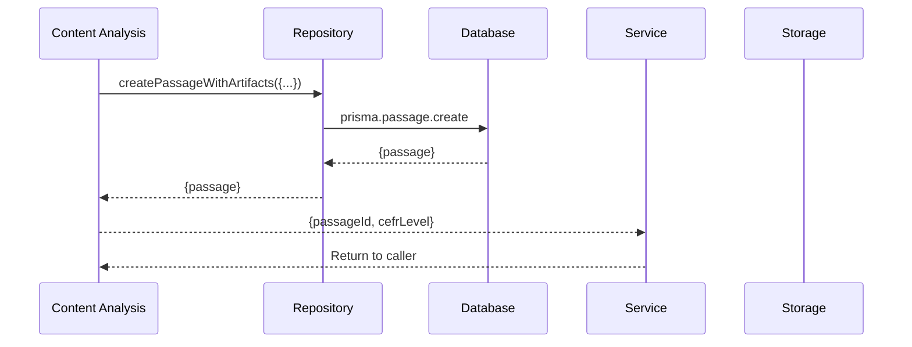
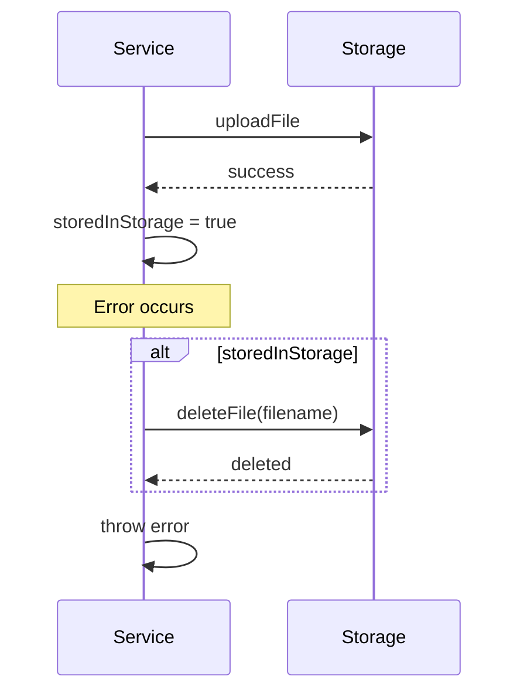

# Upload Feature Data Flow

## Overview

Start: User selects a file on the UI component.
End: UI displays the result (success -> new passage/quiz, or error -> error state).
The data flow always closes at the UI layer because that is where the user sees the system state change.

---

## 1. Overall Data Flow



---

## 2. Upload Sequence



---

## 3. Extract and Analyze



### Text Extraction Logic

| File Type | Method |
|-----------|--------|
| `.txt` | `buffer.toString("utf-8")` |
| `.pdf` | `parsePDF(buffer)` |

---

## 4. Persist and Rollback



### Error Rollback



```typescript
try {
  const result = await uploadFile(filename, buffer);
  storedInStorage = true;
  const analysis = await analyzeAndPersistContent({...});
  return analysis;
} catch (error) {
  if (storedInStorage) await deleteFile(filename);
  throw error;
}
```

---

## File Structure

```
src/features/upload/
├── actions.ts                     # Server Action entry point
├── services/
│   ├── upload-service.ts       # Business logic
│   └── content-analysis.service.ts
├── db/
│   └── content-analysis.repository.ts  # Prisma only
├── hooks/
│   └── use-upload-submit.ts
├── ui/
│   └── upload-modal.tsx
├── lib/
│   ├── upload-validation.ts
│   └── parsers/pdf.ts
└── schemas/
    └── upload.schema.ts
```

## Layer Responsibilities

| Layer | File | Responsibility |
|-------|------|----------------|
| UI | `upload-modal.tsx` | User interaction, error display |
| Action | `actions.ts` | Server action, validation |
| Service | `upload-service.ts` | Orchestration, rollback |
| Analysis | `content-analysis.service.ts` | Text analysis |
| Repository | `content-analysis.repository.ts` | Prisma operations |
| Storage | `@/services/storage` | File storage |

## Response Envelope

```typescript
// Success
{ success: true, data: { passageId, cefrLevel } }

// Error
throw new UploadServiceError(message, status)
```

## Data Flow Closure at UI

```
User Action -> [Server Processing] -> UI Response -> User Sees Result
     ^                                              |
     -------------------------------------------------
                    (Closure)
```
