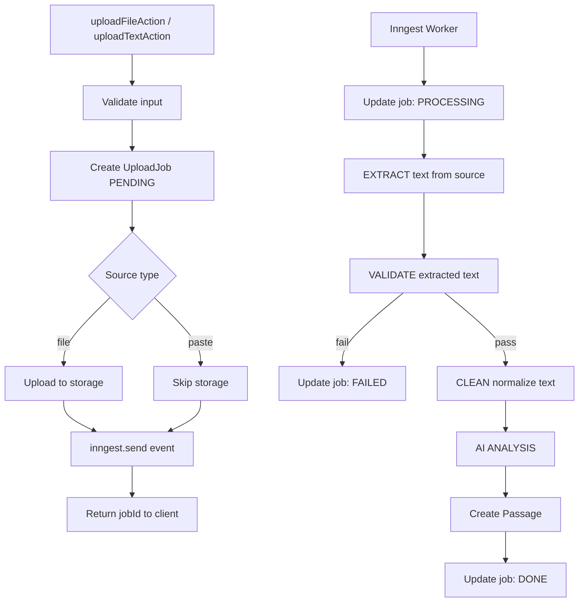

# Upload Data Flow

## Overview

Server-side logic: server action → Inngest queue → background worker → database.

**Key principle:** All parsing happens in the background worker. The server action
only validates and stores the raw file. Bad files become FAILED jobs, never crashes.

---

## Data Flow



---

## Server Action

| Action | Input | What it does |
|--------|-------|--------------|
| `uploadFileAction` | `FormData` | Validate file, store to blob, emit event |
| `uploadTextAction` | `{ passageId, title, text }` | Validate text, emit event with inline text |

### Output

```typescript
{ success: true, data: { jobId: string } }
```

---

## Processing Stages (Inngest Worker)

### Stage 1: EXTRACT

| Source | Extraction |
|--------|------------|
| `paste` | Use inline `text` directly |
| `txt` | Download from storage → UTF-8 decode |
| `pdf` | Download from storage → `parsePDF()` |

### Stage 2: VALIDATE

| Check | Failure |
|-------|---------|
| Not empty | `FAILED: Resolved text is empty` |
| Min length (50 chars) | (via `validateTextContent` in action) |
| Max length (100k chars) | (via `validateTextContent` in action) |

### Stage 3: CLEAN (Normalization)

| Type | Normalizations |
|------|----------------|
| Structural | Line endings (`\r\n` → `\n`), whitespace collapse |
| PDF-specific | Form feeds (`\f` → `\n\n`), empty line removal |

### Stage 4: AI ANALYSIS

| Input | Output |
|-------|--------|
| Cleaned text | `AnalysisResult { cefrLevel, vocabulary, topics }` |

See **[Upload AI Pipeline](./upload-ai-pipeline.md)** for full AI analysis details.

---

## Text Resolution by Source

| Source | Resolution | Parser |
|--------|------------|--------|
| `paste` | Inline text directly | None |
| `txt` | Download from storage → UTF-8 | None |
| `pdf` | Download from storage → `parsePDF()` | `pdf-parse` |
| `youtube` | Fetch transcript (TODO) | — |

---

## Job Status Lifecycle

```
PENDING → PROCESSING → DONE
                ↓
              FAILED
```

| Status | When |
|--------|------|
| `PENDING` | Job created, not yet started |
| `PROCESSING` | Worker picked up the job |
| `DONE` | Passage created successfully |
| `FAILED` | Error occurred (stored in `error` field) |

---

## Key Files

### Server Actions

| File | Purpose |
|------|---------|
| [`upload.ts`](../../features/upload/server/actions/upload.ts) | Server actions: `uploadFileAction`, `uploadTextAction`, `getUploadStatus` |

### Inngest Worker

| File | Purpose |
|------|---------|
| [`process-upload.ts`](../../features/upload/server/inngest/process-upload.ts) | Inngest worker orchestrating pipeline |
| [`events.ts`](../../features/upload/server/inngest/events.ts) | Event schemas |

### Processing Services

| File | Stage | Purpose |
|------|-------|---------|
| [`upload-processor.ts`](../../features/upload/server/services/upload-processor.ts) | Orchestrator | Pipeline step functions |
| [`pdf-parser.ts`](../../features/upload/server/services/parsers/pdf-parser.ts) | EXTRACT | PDF parsing via `pdf-parse` |
| [`upload-validation.ts`](../../features/upload/lib/upload-validation.ts) | VALIDATE | File/text size/content checks |
| [`text-normalizer.ts`](../../features/upload/server/services/normalizers/text-normalizer.ts) | CLEAN | Basic text cleanup |
| [`pdf-normalizer.ts`](../../features/upload/server/services/normalizers/pdf-normalizer.ts) | CLEAN | PDF-specific cleanup |
| [`cefr-detector.ts`](../../features/upload/server/services/analyzers/cefr-detector.ts) | ANALYSIS | AI CEFR detection |
| [`vocabulary-extractor.ts`](../../features/upload/server/services/analyzers/vocabulary-extractor.ts) | ANALYSIS | AI vocabulary extraction |
| [`topic-tagger.ts`](../../features/upload/server/services/analyzers/topic-tagger.ts) | ANALYSIS | AI topic tagging |

---

## Current Limitations

| Issue | Description |
|-------|-------------|
| No text preview | Users cannot see extracted text before AI analysis |
| PDF noise | Headers, footers, page numbers not removed |
| No language detection | Non-English text accepted |
| YouTube not implemented | Transcript fetching is TODO |

---

## Related Docs

- **[Upload Render Flow](./upload-render-flow.md)** — Client-side UI flow
- **[Upload AI Pipeline](./upload-ai-pipeline.md)** — AI enrichment (CEFR, vocabulary)
