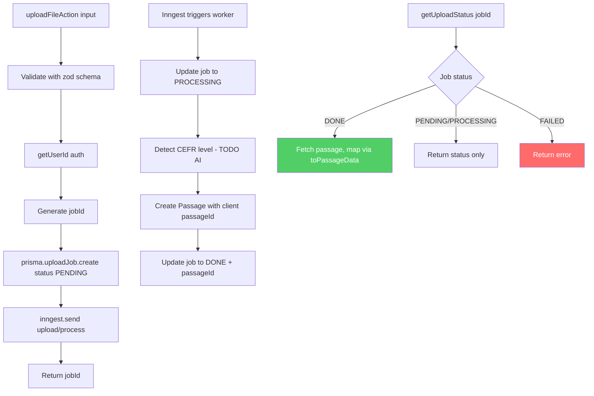
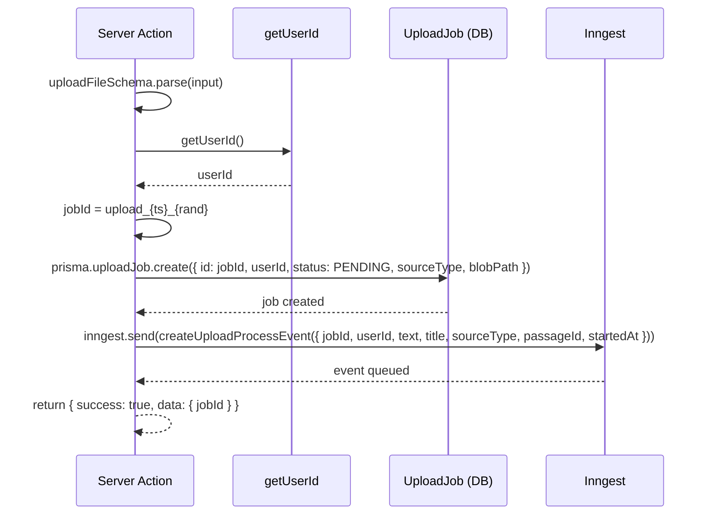
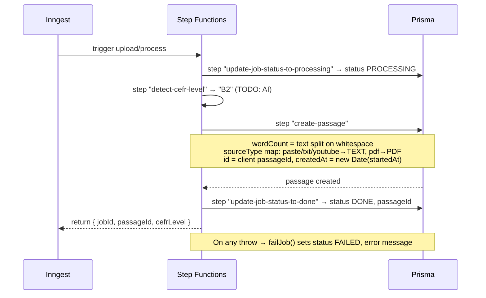
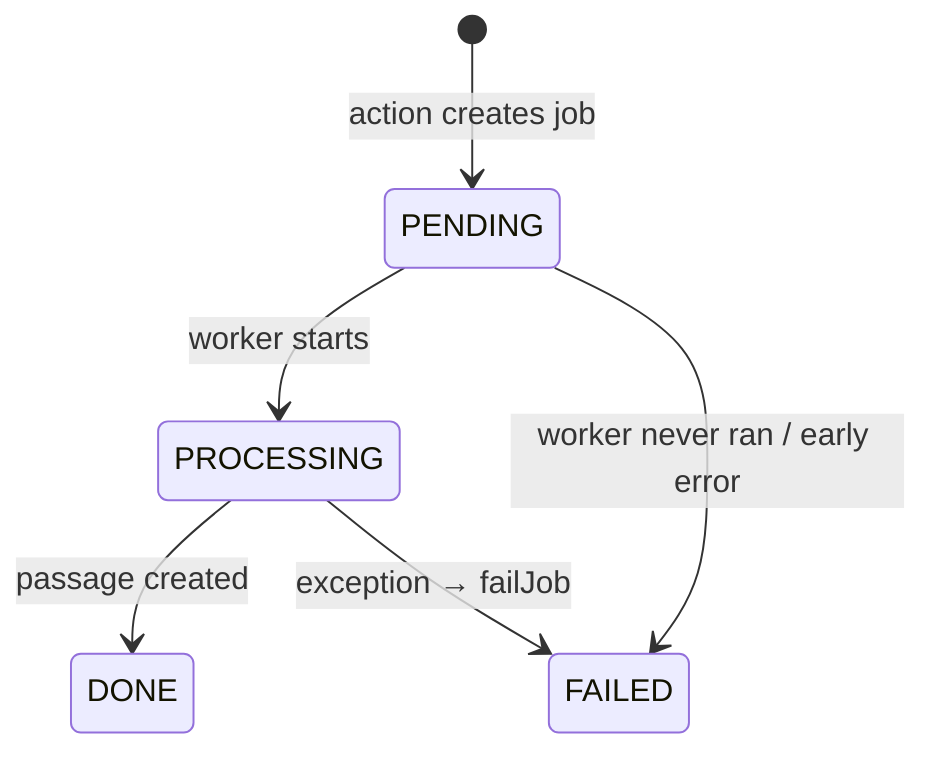

# Upload Feature — Logic & Service Data Flow

## Overview

Server-side logic for the upload feature: the server action, the Inngest event
queue, the background worker, and the `UploadJob` lifecycle in the database.

This document covers **logic/service concerns only**. For how the passage
appears in the UI while it is being processed (temp rows, status field, state
management, `SourcesPanel`), see [Upload Render Flow](./upload-render-flow.md).

---

## Service Components

| Layer | File | Responsibility |
|-------|------|----------------|
| Action | `src/features/upload/actions.ts` | Auth, create `UploadJob`, emit event, expose status |
| Queue | `src/services/inngest/client.ts` | Inngest client + `upload/process` event schema |
| Worker | `src/services/inngest/functions/process-upload.ts` | Async job: detect CEFR → create passage → mark done |
| Database | `prisma.uploadJob` / `prisma.passage` | Job status tracking + persisted passage (called directly from the worker) |
| Mapper | `src/features/passage/schemas/passage.schema.ts` | `toPassageData` — Prisma row → DTO at read boundary |

> Upload creates a **passage only** — it does not generate questions. Question
> generation is a separate, on-demand study feature (`src/features/passage/`).

Two distinct identifiers flow through the system:

- **`jobId`** — server-generated, format `upload_${Date.now()}_${random}`.
  Tracks the processing job.
- **`passageId`** — client-generated UUID, passed in from the UI. Used as the
  Prisma `Passage.id` so the client key stays stable across the temp→real swap
  (see render flow).

---

## 1. Server Logic Flow (Event-Driven)

The action returns as soon as the job is queued; the worker does the real work
asynchronously and the client polls `getUploadStatus` for the result.



---

## 2. Server Action Sequence

`uploadFileAction` is thin: validate, authorize, persist a job, emit an event.



---

## 3. Inngest Worker Processing

`process-upload.ts` runs the job in ordered, retryable `step.run` blocks. Any
thrown error is caught by `failJob`, which marks the job `FAILED` and re-throws.



**Worker steps:**

1. `update-job-status-to-processing` — flips `UploadJob.status` to `PROCESSING`.
2. `detect-cefr-level` — currently returns hardcoded `"B2"`; AI detection is a TODO.
3. `create-passage` — computes `wordCount`, maps the upload `sourceType`
   (`paste`/`txt`/`youtube` → `TEXT`, `pdf` → `PDF`), and creates the `Passage`
   using the client-provided `passageId` and `createdAt = new Date(startedAt)`.
4. `update-job-status-to-done` — sets `status: DONE` and stores `passageId`.

### Per-step service calls (current state)

The worker has **no service/repository layer** — every step calls
`@/lib/prisma` directly inline. CEFR "detection" is a hardcoded stub, not a
service call.

| Step | What it calls now | Module | State |
|------|-------------------|--------|-------|
| `update-job-status-to-processing` | `prisma.uploadJob.update({ status: PROCESSING })` | Direct Prisma | Implemented |
| `detect-cefr-level` | returns `"B2"` inline | None — hardcoded stub | ⚠️ TODO: AI service |
| `create-passage` | `prisma.passage.create({ ... })` inline | Direct Prisma | Implemented (passage only) |
| `update-job-status-to-done` | `prisma.uploadJob.update({ status: DONE, passageId })` | Direct Prisma | Implemented |
| `catch → failJob` | `prisma.uploadJob.update({ status: FAILED, error })` | Direct Prisma | Implemented |

`create-passage` writes a single `Passage` row — no `StudioArtifact` or
`Question[]`. When AI CEFR detection lands, `detect-cefr-level` is the seam that
would delegate to that service; `create-passage` stays a plain passage write.

---

## 4. Job Status Lifecycle



`getUploadStatus(jobId)` reads the job scoped to `userId`. When `status === DONE`
and a `passageId` exists, it fetches the passage row and maps it through
`toPassageData` before returning.

---

## API Contracts

### `uploadFileAction` — input
```typescript
{
  passageId: string,   // Client-generated UUID (becomes Passage.id)
  title: string,       // min length 1
  text: string,        // min length 1
  sourceType: "paste" | "txt" | "pdf" | "youtube",
  startedAt: number,   // Client timestamp → Passage.createdAt (ordering)
  blobPath?: string
}
```

### `uploadFileAction` — response
```typescript
{ success: true, data: { jobId: string } }
```

### `getUploadStatus` — response
```typescript
{
  success: true,
  data: {
    status: "PENDING" | "PROCESSING" | "DONE" | "FAILED",
    passageId: string | null,
    error: string | null,
    passage: PassageData | null,   // Non-null only when DONE
  }
}
```

### `upload/process` — event payload
```typescript
{
  jobId: string,
  userId: string,
  text: string,
  title: string,
  sourceType: "paste" | "txt" | "pdf" | "youtube",
  passageId: string,   // Client UUID
  startedAt: number,
  blobPath?: string
}
```

---

## Error Handling

| Stage | Failure | Behavior |
|-------|---------|----------|
| Action input | Schema invalid | `zod.parse` throws before any DB write |
| Action auth | No user | `getUserId` throws; no job created |
| Create job | DB error | Action throws; surfaced to caller |
| Emit event | Inngest error | Action throws; job left `PENDING` |
| Worker step | Exception | `failJob` sets `status: FAILED` + `error`, re-throws for retry |
| Status read | Job not found / wrong user | Throws `"Job not found"` |

---

## File Structure (logic layer)

```
src/features/upload/
└── actions.ts                       # Server Action: create job, emit event, read status

src/services/inngest/
├── client.ts                        # Inngest client + upload/process event schema
└── functions/
    └── process-upload.ts            # Background worker (step functions)

src/features/passage/
└── schemas/
    └── passage.schema.ts            # PassageData type + toPassageData mapper

prisma/
└── UploadJob, Passage models        # Job status tracking + persisted passage
```

UI files (`upload-modal.tsx`, `sources-panel.tsx`, `use-upload-submit.ts`,
`use-study-workspace-state.ts`) are documented in
[Upload Render Flow](./upload-render-flow.md).

---

## Future Improvements

- [ ] Replace hardcoded CEFR level with AI detection in `detect-cefr-level`.
- [ ] Push status updates (WebSocket/SSE) instead of client polling.
