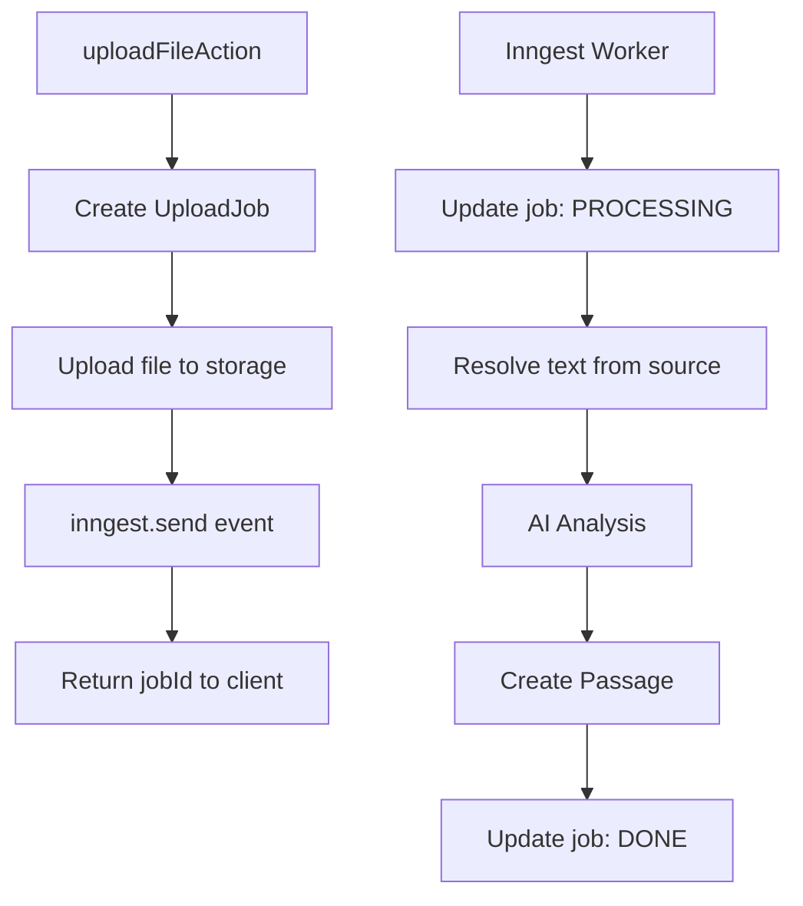

# Upload Data Flow

## Overview

Server-side logic: server action → Inngest queue → background worker → database.

---

## Data Flow



---

## Server Action

| Action | Input | What it does |
|--------|-------|--------------|
| `uploadTextAction` | `{ passageId, title, text }` | Create job, emit event with inline text |
| `uploadFileAction` | `FormData` | Create job, upload file, emit event |

### Output

```typescript
{ success: true, data: { jobId: string } }
```

---

## Text Resolution by Source

| Source | Resolution |
|--------|------------|
| `paste` | Uses inline `text` directly |
| `txt` | Download from storage → UTF-8 |
| `pdf` | Download from storage → parse PDF |
| `youtube` | Fetch transcript (TODO) |

---

## Job Status Lifecycle

```
PENDING → PROCESSING → DONE
                ↓
              FAILED
```

| Status | When |
|--------|------|
| `PENDING` | Job created, not yet started |
| `PROCESSING` | Worker picked up the job |
| `DONE` | Passage created successfully |
| `FAILED` | Error occurred |

---

## Key Files

| File | Purpose |
|------|---------|
| [`actions.ts`](../../features/upload/server/actions/upload.ts) | Server actions |
| [`process-upload.ts`](../../features/upload/server/inngest/process-upload.ts) | Inngest worker |
| [`events.ts`](../../features/upload/server/inngest/events.ts) | Event schemas |

### Processing Services

| File | Purpose |
|------|---------|
| [`upload-processor.ts`](../../features/upload/server/services/upload-processor.ts) | Pipeline orchestrator |
| [`text-normalizer.ts`](../../features/upload/server/services/normalizers/text-normalizer.ts) | Text cleanup |
| [`pdf-parsers.ts`](../../features/upload/lib/pdf-parsers.ts) | PDF parsing |

---

## Related Docs

- **[Upload Render Flow](./upload-render-flow.md)** — Client-side UI flow
- **[Upload AI Pipeline](./upload-ai-pipeline.md)** — AI enrichment (CEFR, vocabulary)
