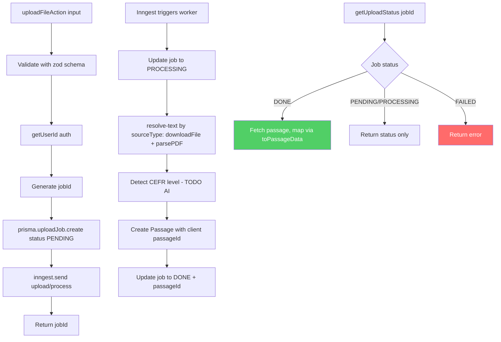
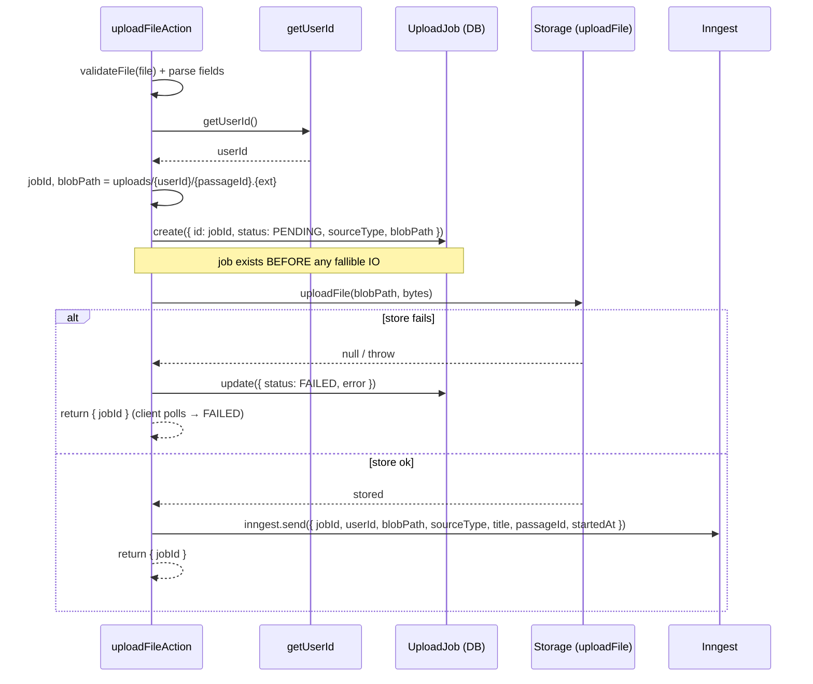
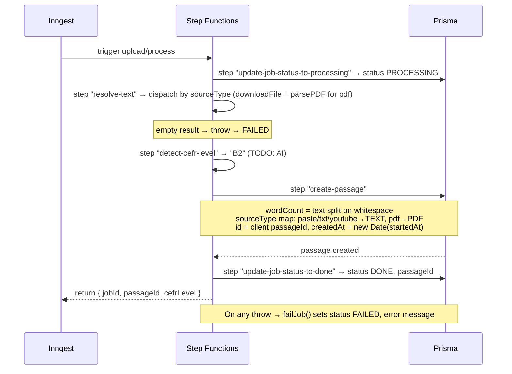
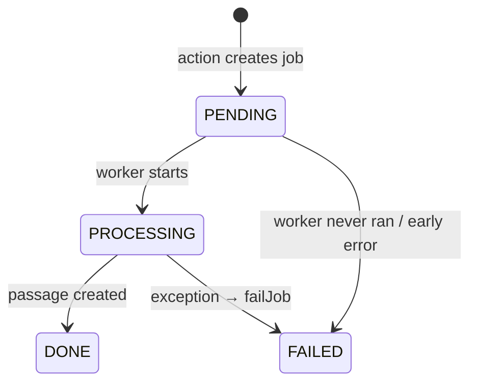

# Upload Feature — Logic & Service Data Flow

## Overview

Server-side logic for the upload feature: the server action, the Inngest event
queue, the background worker, and the `UploadJob` lifecycle in the database.

This document covers **logic/service concerns only**. For how the passage
appears in the UI while it is being processed (temp rows, status field, state
management, `SourcesPanel`), see [Upload Render Flow](./upload-render-flow.md).

---

## Service Components

| Layer | File | Responsibility |
|-------|------|----------------|
| Action | `src/features/upload/actions.ts` | Auth, create `UploadJob`, persist raw file (files only), emit event, expose status |
| Storage | `src/services/storage.ts` | `uploadFile` (action) + `downloadFile` (worker) — local FS in dev, Vercel Blob in prod |
| Queue | `src/services/inngest/client.ts` | Inngest client + `upload/process` event schema (source descriptor) |
| Worker | `src/services/inngest/functions/process-upload.ts` | Async job: resolve+parse text → detect CEFR → create passage → mark done |
| Parser | `src/features/upload/lib/pdf-parsers.ts` | `parsePDF` — invoked by the worker for `pdf` uploads |
| Database | `prisma.uploadJob` / `prisma.passage` | Job status tracking + persisted passage (called directly from the worker) |
| Mapper | `src/types/passage.ts` | `toPassageData` — Prisma row → DTO at read boundary (shared model) |

**Parsing lives in the worker.** The action carries only a lightweight source
descriptor; the worker resolves the passage text from it. This keeps a
crash-prone parse (malformed PDF) inside the retryable job — a failure becomes a
`FAILED` job, never a crashed action/client. Blob storage is a **conditional
side effect**: only file uploads (`txt`/`pdf`) persist a raw file; `paste`
(and future `youtube`) skip storage entirely and the flow still runs.

Text resolution by `sourceType` (`resolve-text` step):

| `sourceType` | Event carries | Blob? | Worker resolves text via |
|--------------|---------------|-------|--------------------------|
| `paste`  | `text` (inline) | ❌ | uses `text` directly |
| `txt`    | `blobPath`      | ✅ | `downloadFile` → utf-8 |
| `pdf`    | `blobPath`      | ✅ | `downloadFile` → `parsePDF().text` |
| `youtube`| `url`           | ❌ | fetch transcript (TODO, not implemented) |

> Upload creates a **passage only** — it does not generate questions. Question
> generation is a separate, on-demand study feature (`src/features/passage/`).

Two distinct identifiers flow through the system:

- **`jobId`** — server-generated, format `upload_${Date.now()}_${random}`.
  Tracks the processing job.
- **`passageId`** — client-generated UUID, passed in from the UI. Used as the
  Prisma `Passage.id` so the client key stays stable across the temp→real swap
  (see render flow).

---

## 1. Server Logic Flow (Event-Driven)

The action returns as soon as the job is queued; the worker does the real work
asynchronously and the client polls `getUploadStatus` for the result.



---

## 2. Server Action Sequence

Two actions split by transport. Both are thin — neither parses.

- `uploadTextAction(input)` — paste: validate, auth, create job, emit event with
  inline `text`. No storage.
- `uploadFileAction(formData)` — `txt`/`pdf`: **job-first** ordering so a blob
  write failure surfaces as `FAILED` (not a silent disruption). The raw file is
  the only synchronous side effect; all parsing is deferred to the worker.



---

## 3. Inngest Worker Processing

`process-upload.ts` runs the job in ordered, retryable `step.run` blocks. Any
thrown error is caught by `failJob`, which marks the job `FAILED` and re-throws.



**Worker steps:**

1. `update-job-status-to-processing` — flips `UploadJob.status` to `PROCESSING`.
2. `resolve-text` — dispatches on `sourceType`: `paste` uses inline `text`;
   `txt`/`pdf` call `downloadFile(blobPath)` then decode utf-8 / `parsePDF`;
   `youtube` is not implemented (throws). Empty result throws → `FAILED`.
3. `detect-cefr-level` — currently returns hardcoded `"B2"`; AI detection is a TODO.
4. `create-passage` — computes `wordCount`, maps the upload `sourceType`
   (`paste`/`txt`/`youtube` → `TEXT`, `pdf` → `PDF`), and creates the `Passage`
   using the client-provided `passageId`, the resolved text as `content`,
   `filePath = blobPath`, and `createdAt = new Date(startedAt)`.
5. `update-job-status-to-done` — sets `status: DONE` and stores `passageId`.

### Per-step service calls (current state)

The worker has **no service/repository layer** — every step calls
`@/lib/prisma` directly inline. CEFR "detection" is a hardcoded stub, not a
service call.

| Step | What it calls now | Module | State |
|------|-------------------|--------|-------|
| `update-job-status-to-processing` | `prisma.uploadJob.update({ status: PROCESSING })` | Direct Prisma | Implemented |
| `resolve-text` | `downloadFile(blobPath)` + `parsePDF` (pdf) / utf-8 (txt) / inline (paste) | Storage + parser | Implemented (youtube TODO) |
| `detect-cefr-level` | returns `"B2"` inline | None — hardcoded stub | ⚠️ TODO: AI service |
| `create-passage` | `prisma.passage.create({ ... })` inline | Direct Prisma | Implemented (passage only) |
| `update-job-status-to-done` | `prisma.uploadJob.update({ status: DONE, passageId })` | Direct Prisma | Implemented |
| `catch → failJob` | `prisma.uploadJob.update({ status: FAILED, error })` | Direct Prisma | Implemented |

`create-passage` writes a single `Passage` row — no `StudioArtifact` or
`Question[]`. When AI CEFR detection lands, `detect-cefr-level` is the seam that
would delegate to that service; `create-passage` stays a plain passage write.

---

## 4. Job Status Lifecycle



`getUploadStatus(jobId)` reads the job scoped to `userId`. When `status === DONE`
and a `passageId` exists, it fetches the passage row and maps it through
`toPassageData` before returning.

---

## API Contracts

### `uploadFileAction(formData)` — input (txt / pdf)
`FormData` fields:
```
file:       File            // raw .txt or .pdf (validated, ≤10MB)
passageId:  string          // Client-generated UUID (becomes Passage.id)
title:      string          // min length 1
sourceType: "txt" | "pdf"
startedAt:  string          // number as string → Passage.createdAt (ordering)
```

### `uploadTextAction(input)` — input (paste)
```typescript
{
  passageId: string,   // Client-generated UUID (becomes Passage.id)
  title: string,       // min length 1
  text: string,        // validated by validateTextContent (50..100k chars)
  startedAt: number,   // Client timestamp → Passage.createdAt (ordering)
}
```

### response (both)
```typescript
{ success: true, data: { jobId: string } }
```
> A blob-write failure in `uploadFileAction` still returns `{ jobId }` — the job
> is marked `FAILED` and surfaced through `getUploadStatus` polling.

### `getUploadStatus` — response
```typescript
{
  success: true,
  data: {
    status: "PENDING" | "PROCESSING" | "DONE" | "FAILED",
    passageId: string | null,
    error: string | null,
    passage: PassageData | null,   // Non-null only when DONE
  }
}
```

### `upload/process` — event payload
Source descriptor: exactly one of `text` / `blobPath` / `url` is set per `sourceType`.
```typescript
{
  jobId: string,
  userId: string,
  title: string,
  sourceType: "paste" | "txt" | "pdf" | "youtube",
  passageId: string,   // Client UUID
  startedAt: number,
  text?: string,       // paste
  blobPath?: string,   // txt / pdf
  url?: string,        // youtube (future)
}
```

---

## Error Handling

| Stage | Failure | Behavior |
|-------|---------|----------|
| Action input | Schema invalid | `zod.parse` throws before any DB write |
| Action auth | No user | `getUserId` throws; no job created |
| Create job | DB error | Action throws; surfaced to caller |
| Emit event | Inngest error | Action throws; job left `PENDING` |
| Worker step | Exception | `failJob` sets `status: FAILED` + `error`, re-throws for retry |
| Status read | Job not found / wrong user | Throws `"Job not found"` |

---

## File Structure (logic layer)

```
src/features/upload/
└── actions.ts                       # Server Action: create job, emit event, read status

src/services/inngest/
├── client.ts                        # Inngest client + upload/process event schema
└── functions/
    └── process-upload.ts            # Background worker (step functions)

src/types/
└── passage.ts                       # PassageData type + toPassageData mapper (shared model)

prisma/
└── UploadJob, Passage models        # Job status tracking + persisted passage
```

UI files (`upload-modal.tsx`, `sources-panel.tsx`, `use-upload-submit.ts`,
`use-study-workspace-state.ts`) are documented in
[Upload Render Flow](./upload-render-flow.md).

---

## Future Improvements

- [ ] Replace hardcoded CEFR level with AI detection in `detect-cefr-level`.
- [ ] Push status updates (WebSocket/SSE) instead of client polling.
