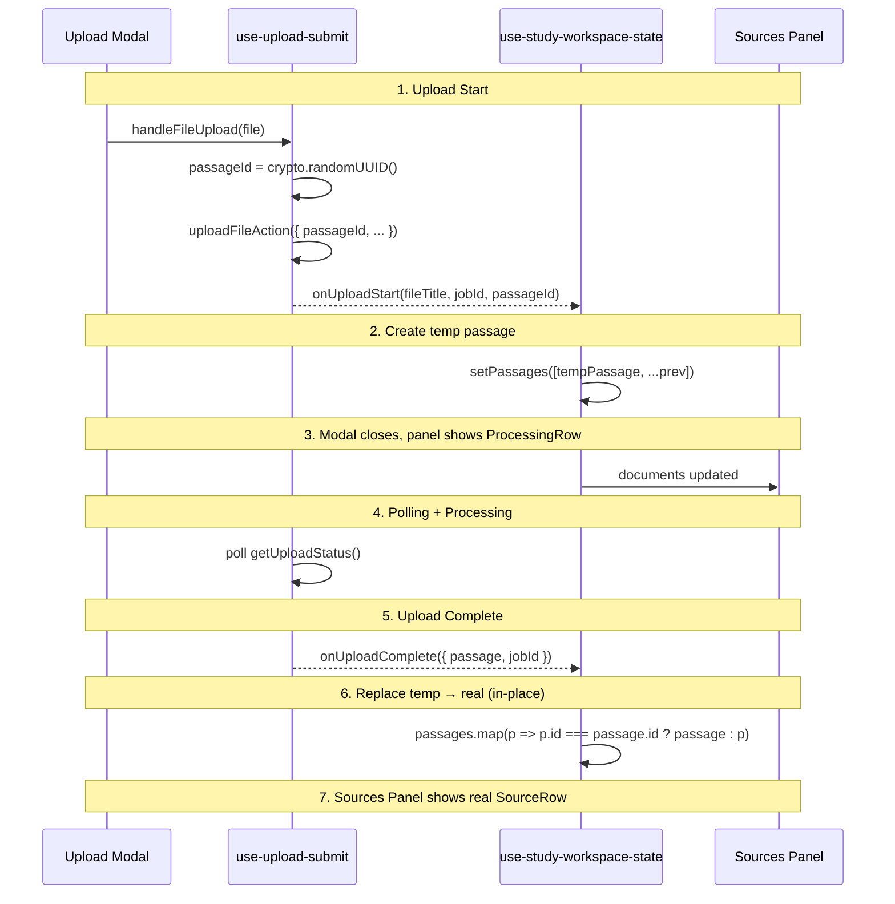

# Upload Feature — Passage Render Flow

## Overview

How a newly uploaded passage appears in the UI **during and after** processing:
the client-generated key, the temp→real swap, status-based rendering, and study
workspace state.

This document covers **UI/render concerns only**. For the server action, event
queue, worker, and `UploadJob` lifecycle, see
[Upload Data Flow](./upload-data-flow.md).

---

## Key Concepts

### 1. Client-Generated UUID

The client generates a stable passage ID before upload starts:
- Stable React keys for smooth transitions
- No duplicate rows from ID mismatch
- Same ID used throughout the flow (client temp row → worker `Passage.id`)

```typescript
// use-upload-submit.ts
const passageId = crypto.randomUUID();
const startedAt = Date.now();

await uploadFileAction({ passageId, title, text, sourceType, startedAt });
```

### 2. Status Field

`PassageData` includes a UI-only `status` field:

```typescript
interface PassageData {
  id: string;
  title: string;
  content: string;
  cefrLevel: string | null;
  wordCount: number;
  createdAt: number;
  sourceType: SourceType;
  status?: "processing" | "ready";
}
```

**Flow:**
1. Temp passage created with `status: "processing"`
2. After upload completes, DB passage mapped with `status: "ready"`
3. In-place replacement maintains stable keys

### 3. toPassageData Mapper

Maps Prisma rows to `PassageData` at the schema boundary; always emits
`status: "ready"` because a row from the DB is, by definition, done:

```typescript
export function toPassageData(row: PassageRow): PassageData {
  return {
    id: row.id,
    title: row.title,
    content: row.content,
    cefrLevel: row.cefrLevel,
    wordCount: row.wordCount,
    createdAt: row.createdAt.getTime(),
    sourceType: row.sourceType,
    status: "ready", // Always ready when from DB
  };
}
```

---

## UI Rendering Flow



---

## State Management

### use-study-workspace-state.ts

**Upload start handler:**
```typescript
const handleUploadStart = useCallback(
  (fileName: string, jobId: string, passageId: string) => {
    const tempPassage: PassageData = {
      id: passageId,
      title: fileName,
      content: "",
      cefrLevel: null,
      wordCount: 0,
      createdAt: Date.now(),
      sourceType: "TEXT",
      status: "processing",
    };
    setPassages((prev) => [tempPassage, ...prev]);
  },
  []
);
```

**Upload complete handler:**
```typescript
const handleUploadComplete = useCallback(
  (data: { passage: PassageData; jobId: string }) => {
    // In-place replace: same ID, status becomes ready
    setPassages((prev) =>
      prev.map((p) => (p.id === passage.id ? passage : p))
    );

    // Only switch if no active passage
    setState((prev) => ({
      ...prev,
      activePassageId: prev.activePassageId ?? passage.id,
    }));
  },
  [router]
);
```

---

## Sources Panel Rendering

### sources-panel.tsx

**Status-based rendering:**
```typescript
{doc.status === "processing" ? (
  <ProcessingRow
    key={doc.id}
    title={doc.title}
  />
) : (
  <SourceRow
    key={doc.id}
    doc={doc}
    active={activeId === doc.id}
  />
)}
```

**ProcessingRow (unclickable during processing):**
```typescript
function ProcessingRow({ title }: { title: string }) {
  return (
    <div className="...cursor-not-allowed opacity-70">
      <div className="absolute inset-0 z-0 bg-accent animate-[upload-fill_2.8s_ease-in-out_forwards]">
        <div className="...animate-[upload-shimmer_1.4s_ease-in-out_infinite]" />
      </div>
      <h4>{title}</h4>
      <p>Processing...</p>
    </div>
  );
}
```

---

## Passage Selection Logic

**Keep current passage if exists:**

```typescript
// Only switch to new passage if no active passage exists
setState((prev) => ({
  ...prev,
  activePassageId: prev.activePassageId ?? passage.id,
}));
```

**Logic:**
1. On initial load → use most recent passage (by `createdAt`)
2. After upload → in-place replace temp with real passage
3. Keep current active passage if already selected
4. Only switch to new passage if no active passage exists

---

## State Transitions

| Event | State Changes |
|-------|--------------|
| Page load | `passages` = DB data, `activePassageId` = most recent |
| Upload start | Create temp passage `status: "processing"` |
| Upload complete | Replace temp with real passage `status: "ready"`, keep active if set |
| Select passage | `activePassageId = selected.id` |
| Delete passage | `passages -= deleted`, select next most recent |

---

## File Structure (render layer)

```
src/app/[locale]/(dashboard)/study/
├── page.tsx                          # RSC: fetches passages
├── _components/
│   └── study-workspace.tsx           # Main UI container
├── _hooks/
│   └── use-study-workspace-state.ts  # State management

src/features/upload/
├── hooks/
│   └── use-upload-submit.ts          # Upload trigger + polling + UUID
└── ui/
    ├── upload-modal.tsx              # Upload UI
    └── sources-panel.tsx             # Sources list + ProcessingRow

src/features/passage/
└── schemas/
    └── passage.schema.ts            # Types + toPassageData mapper
```

---

## Related Files

| File | Purpose |
|------|---------|
| [`upload-data-flow.md`](./upload-data-flow.md) | Logic/service architecture (action, Inngest, DB, worker) |
| `use-study-workspace-state.ts` | Client state management |
| `use-upload-submit.ts` | Upload trigger + polling + UUID generation |
| `sources-panel.tsx` | Sources list with ProcessingRow |
| `passage.schema.ts` | Types + toPassageData mapper |

---

## Future Improvements

- [ ] WebSocket for real-time updates instead of polling
- [ ] SSE for live progress updates during upload
