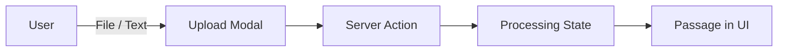

# Upload Render Flow

## Overview

How the UI handles uploads from start to finish.

---

## Input → Output

### Input

| Type | Source | Data |
|------|--------|------|
| File | `upload-modal.tsx` | `File` object (txt/pdf) |
| Text | `upload-modal.tsx` | Inline text |

### Output

| State | UI Shows |
|-------|---------|
| Processing | `ProcessingRow` with shimmer animation |
| Done | `SourceRow` with passage content |

---

## Client-Side Flow

1. User selects file or enters text
2. Client generates `passageId` (UUID) for stable keys
3. `uploadFileAction` / `uploadTextAction` called
4. Temporary passage added to state with `status: "processing"`
5. Modal closes, Sources Panel shows processing state
6. Client polls `getUploadStatus()`
7. On completion, temp → real passage swap (same ID)

---

## State Transitions

| Event | State Change |
|-------|-------------|
| Upload start | Add temp passage `status: "processing"` |
| Upload complete | Replace temp → real `status: "ready"` |
| Select passage | Set `activePassageId` |
| Delete passage | Remove from list, select next |

---

## Key Files

| File | Purpose |
|------|---------|
| [`upload-modal.tsx`](../../features/upload/ui/upload-modal.tsx) | Upload UI |
| [`sources-panel.tsx`](../../features/upload/ui/sources-panel.tsx) | Passage list |
| [`use-upload-submit.ts`](../../features/upload/hooks/use-upload-submit.ts) | Upload trigger + polling |
| [`use-study-workspace-state.ts`](../../app/[locale]/(dashboard)/study/_hooks/use-study-workspace-state.ts) | Client state |

---

## Related Docs

- **[Upload Data Flow](./upload-data-flow.md)** — How uploads are processed server-side
- **[Upload AI Pipeline](./upload-ai-pipeline.md)** — AI enrichment of passages
