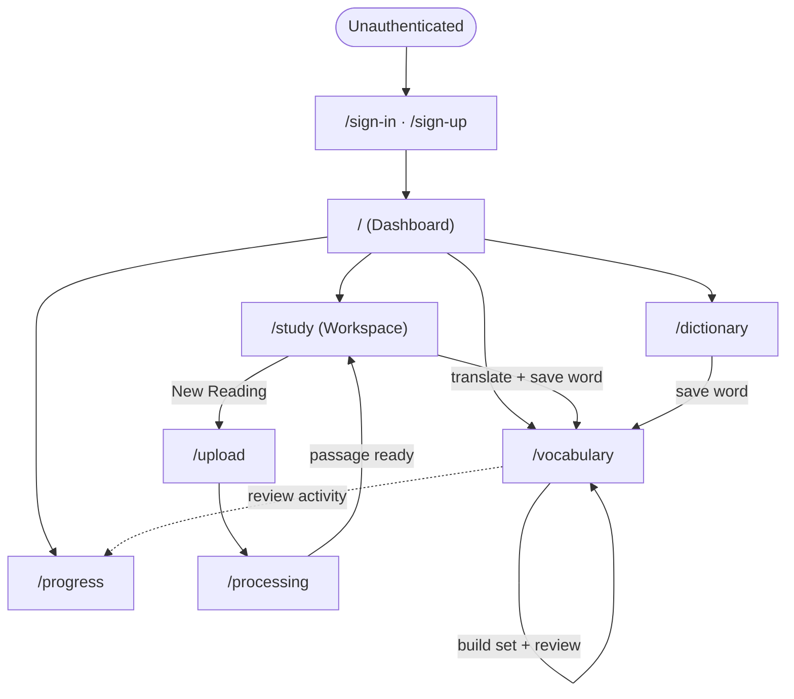

# Navigation Flow

How a learner moves between pages. This doc owns **page-to-page navigation**; per-feature
behavior lives in the other `Flows/*` docs, and route contracts live in
[../API/api-index.md](../API/api-index.md).

## Pages

| Route | Page | Entry points |
|-------|------|--------------|
| `/sign-in`, `/sign-up` | Authentication | Any protected route when unauthenticated |
| `/` | Dashboard (landing after sign-in) | Post sign-in, sidebar "Dashboard" |
| `/progress` | Progress dashboard (streak, time studied, active days) | Dashboard, sidebar (grouped under Dashboard) |
| `/study` | Three-panel study workspace | Sidebar "Study", "New Reading", after processing |
| `/upload` | Upload / paste content | Study "New Reading" |
| `/processing` | Analysis in progress | After an upload is submitted |
| `/vocabulary` | Word bank + word sets + review | Sidebar "Vocabulary", save-from-translate |
| `/dictionary` | Standalone dictionary / translate lookup | Sidebar "Dictionary" |

The primary sidebar exposes four destinations: **Dashboard (`/`)**, **Study (`/study`)**,
**Vocabulary (`/vocabulary`)**, **Dictionary (`/dictionary`)**.

## Flow

## Notes

- Unauthenticated access to any protected route redirects to `/sign-in?redirect_url={original}`,
  then returns the learner to where they were headed (see [auth-flow.md](auth-flow.md)).
- `/study` is the hub: import (`/upload` → `/processing`), comprehension, chat, and
  translate-to-save all originate here.
- Both `/study` (inline) and `/dictionary` (standalone) can save words into `/vocabulary`,
  which feeds the spaced-repetition review (see [spaced-repetition-flow.md](spaced-repetition-flow.md)).
