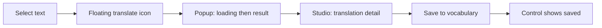
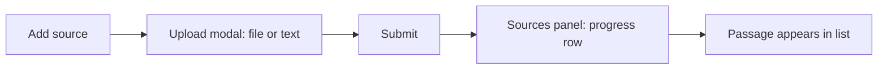

# UI Flows

**Lens:** user-facing, interaction-centric — the step-by-step *interactions within a screen*
a learner performs to complete a task (click, select, type, confirm) and what the UI does in response.

Read this for *what the user does and sees*; cross to the feature flow for *how the code fulfills it*, and to the [per-page docs](../../Architecture/frontend-ui-architecture/README.md)
for the components involved.

## Translate a selection and save a word

Screen: [Study](../../Architecture/frontend-ui-architecture/pages/study-page.md) center + studio panels.
Code path: [translation-flow.md](../data-flows/translation-flow.md), [vocabulary-flow.md](../data-flows/vocabulary-flow.md).

1. User selects text inside the reading content.
2. On release, a compact floating **translate icon** appears near the selection.
   (Over-limit selections are cleared and no icon shows.)
3. User clicks the icon → a fixed 280px **popup** shows the source text with a loading state.
4. Translation resolves → popup shows the result plus a **Details** action.
5. User clicks **Details** → the studio panel switches to the **Translation detail** view
   (`StudyTranslatePanel`) with the selected text as the title.
6. User clicks **Save** → the word is saved; the saved state is remembered so the control
   reflects "already saved" and does not double-submit.

## Simplify a passage to a lower CEFR level

Screen: [Study](../../Architecture/frontend-ui-architecture/pages/study-page.md) center panel.
Code path: [study-flow.md](../data-flows/study-flow.md).

1. User opens a passage whose CEFR level is above A2 → a compact **Simplify** action shows.
   (A1/A2 passages hide it; they are already beginner-friendly.)
2. User clicks **Simplify** → reader enters a centered loading state.
3. Simplified content resolves → reader shows a two-option **segmented control**
   (`simplified` / `original`); user toggles between versions.
4. On failure → a destructive inline notice appears below the content; original stays readable.

## Add a source (upload or paste)

Screen: [Study](../../Architecture/frontend-ui-architecture/pages/study-page.md) upload modal →
sources panel. Code path: [upload-flow.md](../data-flows/upload-flow.md).

1. User clicks **add source** (sources panel header, or "New Reading").
2. The **upload modal** opens with two modes: file (dropzone) or text (paste).
3. User provides a file or pasted text and submits.
   - Modal-local validation errors render inline in the modal.
4. On submit, the modal **closes immediately**; an **upload progress row** appears in the
   sources panel while analysis runs.
5. When the passage is ready, it joins the source list and becomes selectable.

## Generate a studio artifact (quiz / summary)

Screen: [Study](../../Architecture/frontend-ui-architecture/pages/study-page.md) studio panel.
Code path: [study-flow.md](../data-flows/study-flow.md).

1. With a passage active, user clicks a **studio action card** (Quiz, Summary). Disabled
   cards (Flashcards, Mind map) do not respond.
2. The action locks while the same generation type is running; up to **3** generated-result
   actions run concurrently. Chat is independent of this limit.
3. A running indicator shows in the results list (and on the collapsed rail).
4. On completion, the artifact appears in the **results list**.
5. User opens a result → studio switches to the artifact **detail view** (quiz or summary).
6. For a quiz: user answers question by question (`QuizContent`); on completion the
   **results view** (`QuizResults`) shows the score.

## Look up a word in the dictionary and save it

Screen: [Dictionary](../../Architecture/frontend-ui-architecture/pages/dictionary-page.md).
Code path: [dictionary-flow.md](../data-flows/dictionary-flow.md), [vocabulary-flow.md](../data-flows/vocabulary-flow.md).

1. User types in the search field → **suggestions** appear.
2. User picks a suggestion or submits → the **entry detail** renders.
3. User clicks **save** → the word is added to vocabulary; the control reflects the saved
   state (same save-once behavior as the Study translate flow).

## Review vocabulary (spaced repetition)

Screen: [Vocabulary](../../Architecture/frontend-ui-architecture/pages/vocabulary-page.md).
Code path: [vocabulary-flow.md](../data-flows/vocabulary-flow.md),
[spaced-repetition-flow.md](../data-flows/spaced-repetition-flow.md).

1. User opens Vocabulary → **Words** and **Sets** tabs.
2. User builds a set, then starts a review session.
3. User grades each card; grades feed the scheduler, which sets the next due date and updates
   review activity surfaced on the dashboard.

## Conventions across UI flows

- **Save-once:** save controls (translate, dictionary) remember the saved key and disable to
  prevent duplicate submits.
- **Non-blocking errors:** inline destructive notices keep the primary content usable; they do
  not replace the screen.
- **Progress where work happens:** long operations (upload analysis, artifact generation) show
  progress in their owning panel, not a global blocker, so the user keeps reading.
- **Detail-in-place:** studio detail views replace the studio list in the same panel with a
  back affordance, rather than navigating away.
