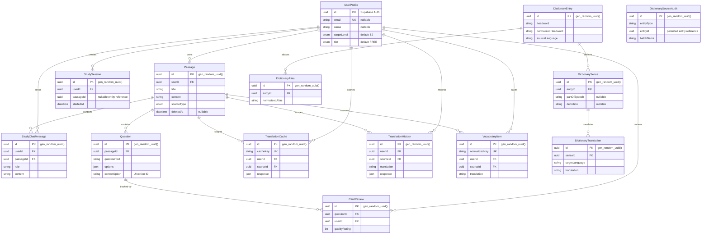

# Entity Relationship Diagram (ERD)

**English Reading Training App**

All persisted identifiers in the PostgreSQL `public` schema use native `uuid`.
Supabase Auth supplies `UserProfile.id`; application-owned records use
`gen_random_uuid()`.

## Identifier Notes

- `StudySession.passageId` is a nullable UUID entity reference without a
  database foreign-key relation.
- `DictionarySourceAudit.entityId` is a UUID entity reference. `entityType`
  identifies the referenced public entity type.
- `Question.options` and `Question.correctOption` contain UI/result option IDs,
  not persisted public-table identifiers.
- Ordinary string keys such as `cacheKey`, `normalizedKey`, and
  `stripeCustomerId` remain text.

## Cascade Rules

| Parent | Children with `ON DELETE CASCADE` |
|--------|------------------------------------|
| UserProfile | Passage, StudyChatMessage, CardReview, StudySession, TranslationCache, TranslationHistory, VocabularyItem |
| Passage | StudyChatMessage, Question, TranslationCache, TranslationHistory, VocabularyItem |
| Question | CardReview |
| DictionaryEntry | DictionarySense, DictionaryAlias |
| DictionarySense | DictionaryTranslation |

**Last Updated:** 2026-06-04
