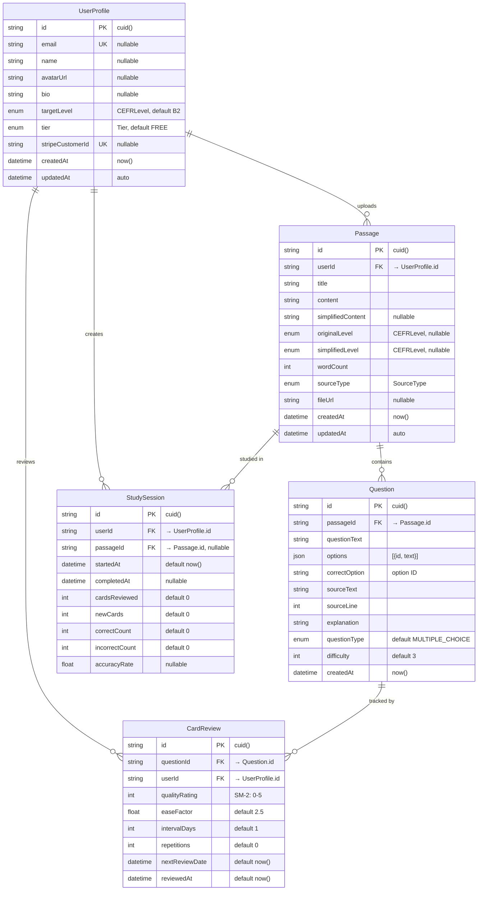
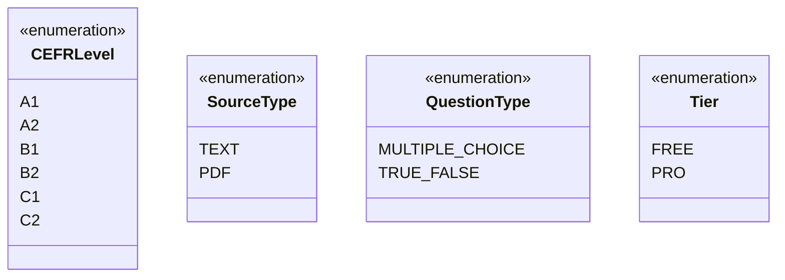

# Entity Relationship Diagram (ERD)

**English Reading Training App**

---

## Mermaid ERD

---

## Relationship Summary

| Relationship | Cardinality | Cascade |
|-------------|-------------|---------|
| UserProfile → Passage | One-to-Many | Yes |
| UserProfile → StudySession | One-to-Many | Yes |
| UserProfile → CardReview | One-to-Many | Yes |
| Passage → Question | One-to-Many | Yes |
| Question → CardReview | One-to-Many | Yes |
| Passage → StudySession | One-to-Many (nullable) | No |

---

## Indexes

| Table | Index | Purpose |
|-------|-------|---------|
| Passage | `[userId, createdAt]` | Query user's passages sorted by date |
| CardReview | `[userId, nextReviewDate]` | Fetch due cards for review |
| StudySession | `[userId, startedAt]` | Query user's sessions sorted by date |
| CardReview | `[questionId, userId]` UNIQUE | Prevent duplicate reviews per card |

---

## Enum Definitions

---

**Last Updated:** 2026-05-09
