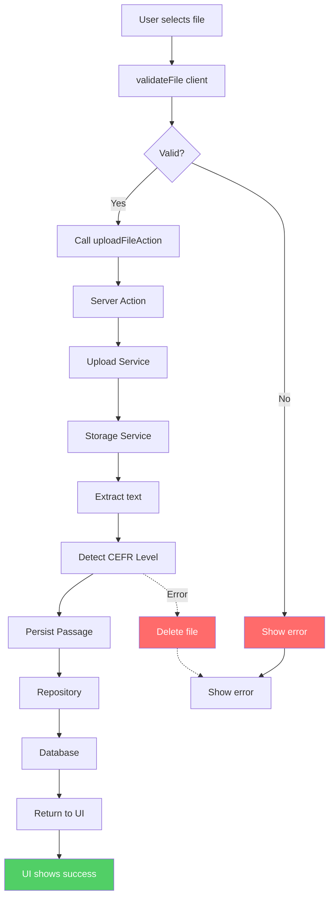
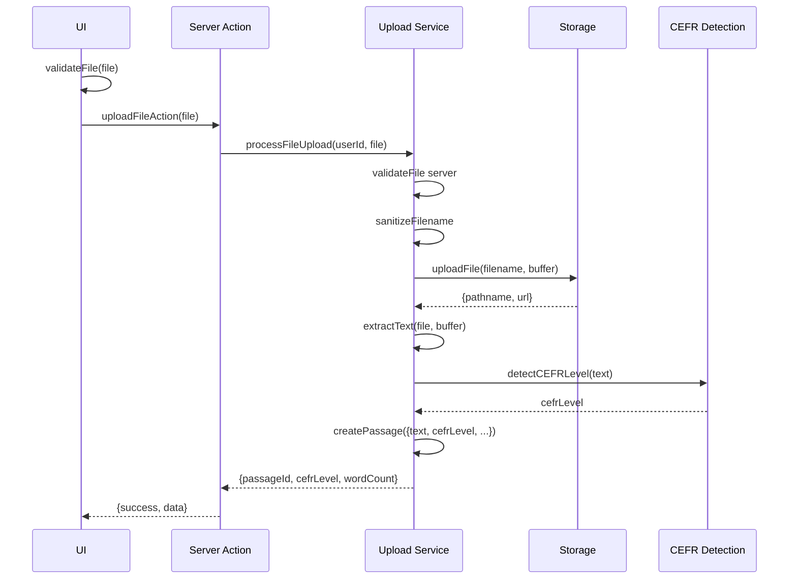
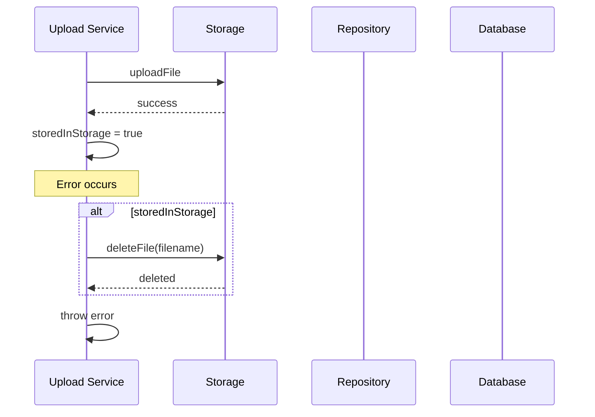
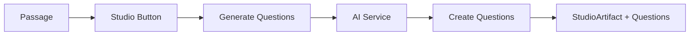

# New Upload Workflow (Proposed)

## Overview

Upload tạo passage + detect CEFR level. Không sinh câu hỏi trong quá trình upload.

**Start:** User selects a file on the UI component.
**End:** UI displays success với passageId + metadata.

---

## 1. Overall Data Flow



---

## 2. Upload Sequence



---

## 3. Text Extraction Logic

| File Type | Method |
|-----------|--------|
| `.txt` | `buffer.toString("utf-8")` |
| `.pdf` | `parsePDF(buffer)` |

---

## 4. Persist and Rollback



```typescript
try {
  const result = await uploadFile(filename, buffer);
  storedInStorage = true;
  const passage = await createPassage({...});
  return passage;
} catch (error) {
  if (storedInStorage) await deleteFile(filename);
  throw error;
}
```

---

## 5. Quiz Generation (Separate Flow - Studio)

Question generation KHÔNG xảy ra trong upload. Learner chủ động trigger từ Studio button.



---

## Response Envelope

```typescript
// Success
{ success: true, data: { passageId, cefrLevel, wordCount } }

// Error
throw new UploadWorkflowError(message, status)
```

### Response Schema (upload.schema.ts)

```typescript
export const uploadResultSchema = z.object({
  passageId: z.string(),
  cefrLevel: z.string(),
  wordCount: z.number(),  // THAY ĐỔI: thay questionCount bằng wordCount
}).strict();
```

---

## Files to Update

| File | Action | Changes |
|------|--------|---------|
| `docs/Data-flow/upload-flow.md` | UPDATE | Remove questionCount, update flow |
| `docs/Requirements/software-requirements.md` | UPDATE | FR-03 mark as Deferred/Studio |
| `src/features/upload/schemas/upload.schema.ts` | UPDATE | schema trả về wordCount thay vì questionCount |
| `src/features/upload/services/content-analysis.service.ts` | NO CHANGE | hiện hardcode B2, CEFR AI sau |

---

## Notes

- CEFR Detection: hiện hardcode B2. AI detection (FR-02) sẽ implement sau.
- Question Generation (FR-03): deferred. Studio button sẽ gọi separate AI flow.
- Upload workflow chỉ tạo Passage record, không tạo Questions hay StudioArtifact.
