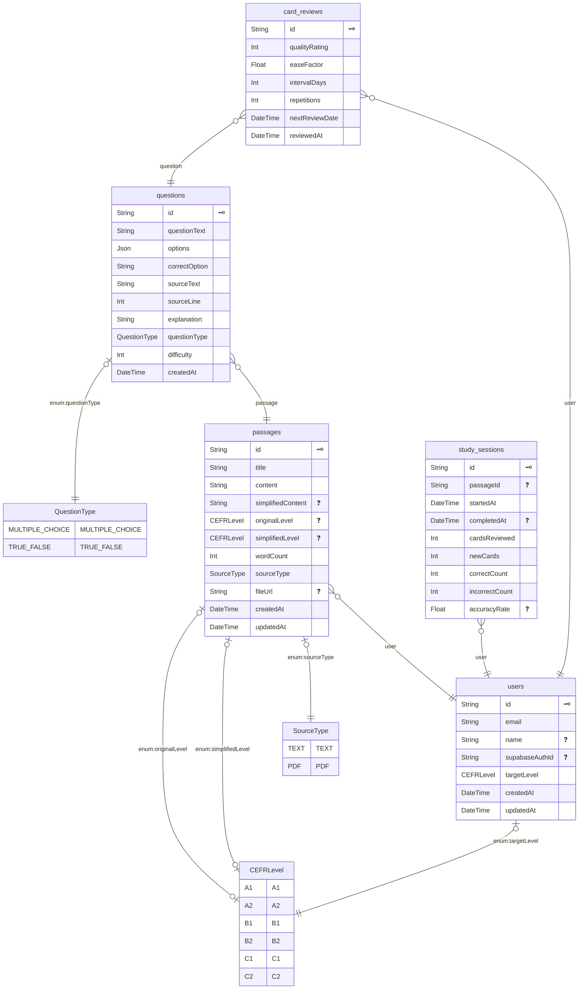

```mermaid
erDiagram

        CEFRLevel {
            A1 A1
A2 A2
B1 B1
B2 B2
C1 C1
C2 C2
        }
    


        SourceType {
            TEXT TEXT
PDF PDF
        }
    


        QuestionType {
            MULTIPLE_CHOICE MULTIPLE_CHOICE
TRUE_FALSE TRUE_FALSE
        }
    
  "users" {
    String id "🗝️"
    String email 
    String name "❓"
    String supabaseAuthId "❓"
    CEFRLevel targetLevel 
    DateTime createdAt 
    DateTime updatedAt 
    }
  

  "passages" {
    String id "🗝️"
    String title 
    String content 
    String simplifiedContent "❓"
    CEFRLevel originalLevel "❓"
    CEFRLevel simplifiedLevel "❓"
    Int wordCount 
    SourceType sourceType 
    String fileUrl "❓"
    DateTime createdAt 
    DateTime updatedAt 
    }
  

  "questions" {
    String id "🗝️"
    String questionText 
    Json options 
    String correctOption 
    String sourceText 
    Int sourceLine 
    String explanation 
    QuestionType questionType 
    Int difficulty 
    DateTime createdAt 
    }
  

  "card_reviews" {
    String id "🗝️"
    Int qualityRating 
    Float easeFactor 
    Int intervalDays 
    Int repetitions 
    DateTime nextReviewDate 
    DateTime reviewedAt 
    }
  

  "study_sessions" {
    String id "🗝️"
    String passageId "❓"
    DateTime startedAt 
    DateTime completedAt "❓"
    Int cardsReviewed 
    Int newCards 
    Int correctCount 
    Int incorrectCount 
    Float accuracyRate "❓"
    }
  
    "users" |o--|| "CEFRLevel" : "enum:targetLevel"
    "passages" |o--|o "CEFRLevel" : "enum:originalLevel"
    "passages" |o--|o "CEFRLevel" : "enum:simplifiedLevel"
    "passages" |o--|| "SourceType" : "enum:sourceType"
    "passages" }o--|| users : "user"
    "questions" |o--|| "QuestionType" : "enum:questionType"
    "questions" }o--|| passages : "passage"
    "card_reviews" }o--|| questions : "question"
    "card_reviews" }o--|| users : "user"
    "study_sessions" }o--|| users : "user"
```
